<p align="center">
  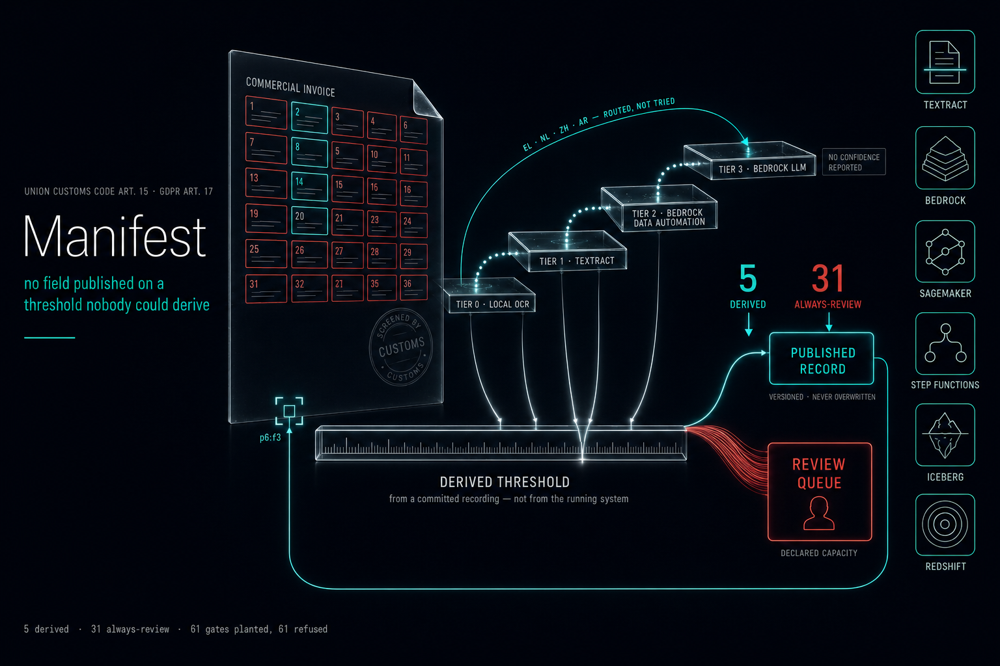
</p>

# Manifest

<p align="center">
  <a href="https://github.com/theofanis-tsakanikas/manifest/actions/workflows/ci.yml"></a>
  <a href="LICENSE"></a>
  
  
  <br>
  
  
  
  
  
  
  
  <br>
  
  
  
  
  
</p>

**A document intelligence platform for cross-border trade, where a published field that cannot
be located on a page is a build failure — and a confidence threshold nobody could derive means
the field goes to a human, not to a number that sounds safe.**

*Textract · Bedrock Data Automation · Bedrock · SageMaker · Step Functions · Lambda · Iceberg on S3 · Athena · OpenSearch · Redshift · EMR Serverless · Terraform*

> **Manifest** — the trade document, and the word for *made evident*. Both meanings are the project.

---

## The problem

A customs broker receives the paperwork for a shipment: a bill of lading, a commercial invoice, a
packing list, a certificate of origin, a customs declaration, an arrival notice. They arrive as
scans of scans — skewed, stamped over the numbers, in three languages, with tables that break
across pages and handwritten corrections in the margin. Three things have to come out of them: a
structured record per document, agreement between documents that must agree, and a tariff
classification. A wrong classification is quantifiable financial and legal exposure, and a wrong
weight on a declaration is a customs problem that surfaces months later.

Every system built for this eventually faces the same question, and most answer it with a number
that sounds reassuring: *at what confidence do we publish?* Manifest refuses to answer it by
hand. Each field declares an **error budget** — the acceptable rate of published-and-wrong — and
the threshold is **derived** from that budget against a labelled set, with the upper confidence
bound and N printed beside it. Where no threshold fits the budget at the data available, the
field is declared **always-review**. On this corpus that is **31 of 36 fields**, and printing
that number rather than hiding it is the point of the project.

---

## Status

Deployed to a real AWS account on **19 August 2026** and torn down the same day. One dispatch of
[`deploy.yml`](.github/workflows/deploy.yml) ran the whole test suite, then applied five Terraform
layers — `foundation`, `lakehouse`, `extraction`, `batch`, `analytics` — in **49m 32s**, with
Textract, Bedrock, SageMaker Serverless Inference, OpenSearch Serverless and Redshift Serverless
all switched on. Documents were then put through the deployed pipeline and the estate was asked
whether it had behaved.

<p align="center">
  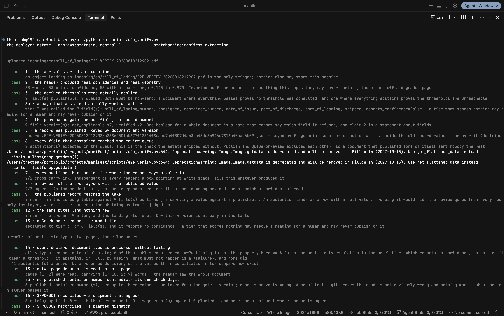<br>
  <sub><b>34/34 against the live account</b> — not fixtures. Check <b>2</b>: 53 words, every one with
  a real confidence and a real box, range 0.145–0.970, off a degraded page. Check <b>3b</b>: the
  fields that abstained went <i>up a tier</i>, to a model that reports no confidence and may never
  publish on it. Check <b>9</b>: an abstention lands in the lake as a row with a null value, because
  dropping it would hide the review queue from the analytics layer.</sub>
</p>

<p align="center">
  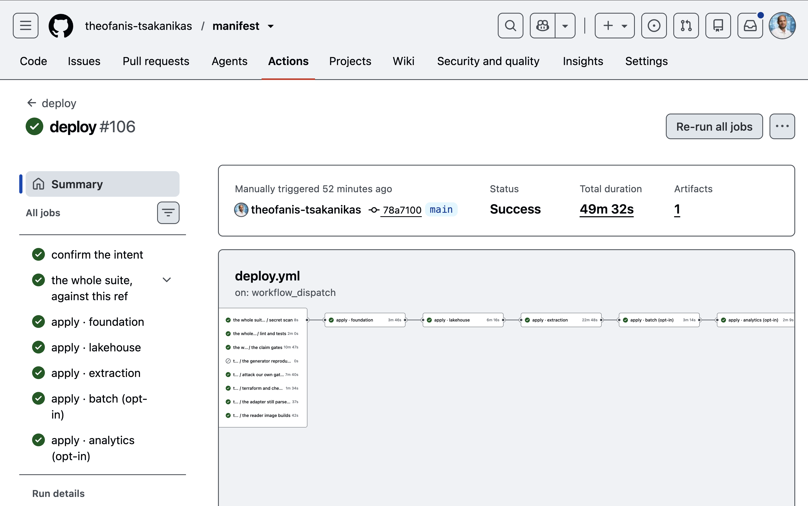<br>
  <sub><b>One dispatch, gate first</b> — the whole suite runs upstream of every apply, so nothing
  reaches AWS until all of it is green. <code>attack our own gates</code> 7m 40s and
  <code>the claim gates</code> 10m 47s are inside that gate, not after it.</sub>
</p>

**The estate is destroyed.** The resting state of this repository is a state bucket, its key, five
SSM parameters and a deploy role. Everything below also runs with **no AWS account at all**: 502
tests, 15 evaluation harnesses and 57 planted gate violations, on a laptop, in about ten minutes.

---

## The seven claims

Every row is the output of one command in this repository, and
[`scripts/preflight.py`](scripts/preflight.py) re-reads this table and fails the build when a
figure here stops matching the figure that run produced.

| | result |
|---|---|
| **claim 1** · thresholds are derived, never chosen | **36** fields — **5** with a derived threshold, **31** always-review; of those, **1** by contract, **4** evidence-limited, **25** quality-limited, **1** with no confident population to judge at all |
| **claim 2** · every published field traces to a page | honest records **94/120** verified; corrupted boxes **120/120**, **120/120**, **6/6** refused, each by the layer that should catch it |
| **claim 3** · re-extraction is reproducible and versioned | **3,000/3,000** documents publish an identical version from the same input; **3,000/3,000** get a new version from a reader change |
| **claim 4** · disagreement is surfaced, never smoothed | exactly **123** planted disagreements found, **0** false positives on the set that agrees |
| **claim 5** · the human loop is real, and measured | capacity **4,320** decisions/day declared against **120,000** queued — the gate fires, and passes only on a named acceptance that expires |
| **claim 6** · entity resolution is reversible | **21** surface forms → **13** entities, **0** mixing two parties; un-merge re-points **3/3** downstream records |
| **claim 7** · bulk reprocessing is idempotent | first pass 3,000, immediate re-run **0**, resume **exactly** the 1,500 remaining; **0.59 USD** per 1,000 pages, *modelled* |

Four more that are not claims but are the reason the claims mean anything. The corpus stays
inside its **declared operating envelope**. A confidence of 0.9 transports to paper nobody here
designed — and in the direction that is awkward to report: **ECE 0.0815** on the generated corpus
against **0.0592** on 100 pages of real photographed documents, so the reader is *better*
calibrated on paper it has never seen than on paper this repository drew. Untrusted document text
is fenced with **0 false positives** across **2,969** documents of ordinary trade prose. And the
derived policy is scored against the alternatives: publishing everything is **26.72%** wrong, a
hand-picked 0.85 is **4.68%**, derived is **0.22%** — with **no declared budget missed**, at
**19,626** items queued, and the queue cost printed beside the wrong-rate every time.

---

## Contents

| | |
|---|---|
| [The problem](#the-problem) · [Status](#status) | what breaks, and what actually ran |
| [The seven claims](#the-seven-claims) | one command per row, and a check that re-reads it |
| [Architecture](#architecture) | one diagram, four tiers, five layers |
| [Thresholds are derived, not chosen](#thresholds-are-derived-not-chosen) | claim 1, and why 31 fields publish nothing |
| [Every field is where the record says it is](#every-field-is-where-the-record-says-it-is) | claim 2, checked against the page |
| [The human loop is real, and measured](#the-human-loop-is-real-and-measured) | claim 5, capacity and rubber stamps |
| [A correction never erases](#a-correction-never-erases) | claims 3 and 4, versions and disagreement |
| [The cascade, and what it may not claim](#the-cascade-and-what-it-may-not-claim) | claim 7, routing and a cost *model* |
| [The gates are attacked](#the-gates-are-attacked) | 57 planted violations, each refused by name |
| [Quickstart](#quickstart) · [Testing](#testing) · [Repository layout](#repository-layout) | |
| [What this does not do](#what-this-does-not-do) · [Cost](#cost) · [Decisions](#decisions) | |
| [Docs](#docs) · [Security](#security) · [License](#license) | |

---

## Architecture

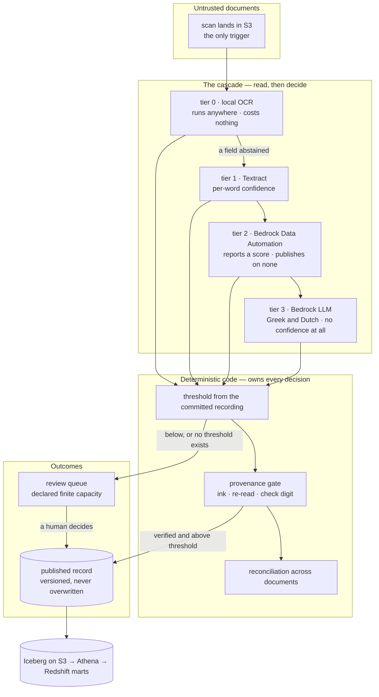
```mermaid
flowchart TB
  subgraph ingest["Untrusted documents"]
    DOC["scan lands in S3<br/>the only trigger"]
  end

  subgraph read["The cascade — read, then decide"]
    T0["tier 0 · local OCR<br/>runs anywhere · costs nothing"]
    T1["tier 1 · Textract<br/>per-word confidence"]
    T2["tier 2 · Bedrock Data Automation<br/>reports a score · publishes on none"]
    T3["tier 3 · Bedrock LLM<br/>Greek and Dutch · no confidence at all"]
  end

  subgraph decide["Deterministic code — owns every decision"]
    THR["threshold from the committed recording"]
    PROV["provenance gate<br/>ink · re-read · check digit"]
    REC["reconciliation across documents"]
  end

  subgraph out["Outcomes"]
    PUB[("published record<br/>versioned, never overwritten")]
    Q["review queue<br/>declared finite capacity"]
  end

  DOC --> T0
  T0 -->|"a field abstained"| T1 --> T2 --> T3
  T0 & T1 & T2 & T3 --> THR --> PROV --> REC
  PROV -->|"verified and above threshold"| PUB
  THR -->|"below, or no threshold exists"| Q
  Q -->|"a human decides"| PUB
  PUB --> LAKE[("Iceberg on S3 → Athena → Redshift marts")]
```

Three things in that diagram carry the design. **Models only ever appear on the left**: they read
characters and propose fields, and nothing in the middle column is a model. **The threshold does
not come from the running system** — it is derived offline from a committed engine recording and
shipped as an artefact, so a runner image upgrade cannot silently move a number. And **the queue
is a first-class outcome**, not an error path: abstention is the safe state, and the volume it
generates is measured against a declared capacity that the build will fail over.

---

## Thresholds are derived, not chosen

Each field declares an error budget. The threshold is the lowest score whose 95% upper bound on
the published-and-wrong rate still fits that budget — computed against the labelled set, with
calibration measured and **N printed beside every figure**.

<p align="center">
  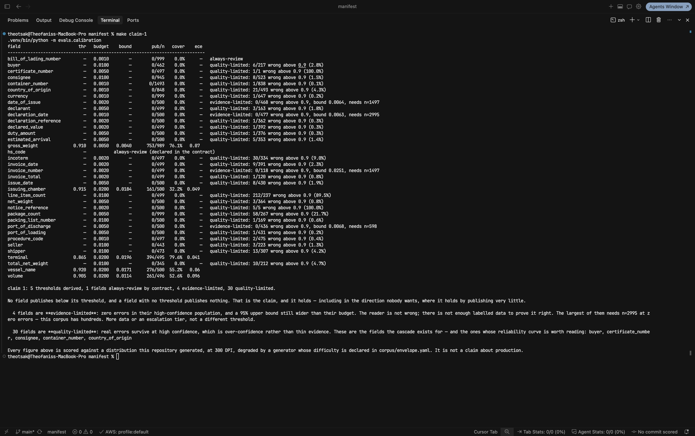<br>
  <sub><b>Five thresholds, thirty-one refusals</b> — and the reason is named per field.
  <code>gross_weight</code> derives <b>0.910</b> at a 0.0050 budget with a 0.0040 bound, covering
  76.1% of 989 items at ECE 0.07. <code>date_of_issue</code> derives nothing:
  <i>evidence-limited, 0/468 wrong above 0.9, needs n=1497</i> — the reader is not wrong, there is
  not enough labelled data to prove it right. <code>line_item_count</code> is the opposite:
  <i>212/237 wrong above 0.9</i>, which is over-confidence, not thin evidence.</sub>
</p>

The distinction in that last sentence is the whole section. **Evidence-limited** fields need more
data or an escalation tier. **Quality-limited** fields need a better reader. Collapsing both into
"low confidence" would hide which one you have, and they have opposite fixes.

The derived artefact is what the deployed estate actually consults — not a number recomputed at
runtime.

<p align="center">
  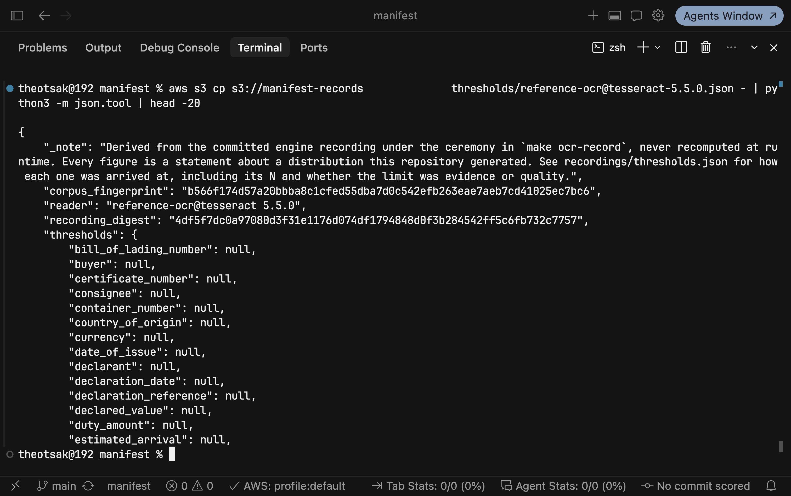<br>
  <sub><b>The artefact states its own limits</b> — <code>reference-ocr@tesseract 5.5.0</code>, a
  corpus fingerprint, a recording digest, and a note saying every figure is a statement about a
  distribution this repository generated. The file name carries the reader and its version, so an
  engine upgrade cannot read the old engine's thresholds.</sub>
</p>

---

## Every field is where the record says it is

Every published field carries a page, a bounding box and a document version. This is what that
sentence means, drawn from the committed recording with `python3 scripts/provenance_still.py`:

<p align="center">
  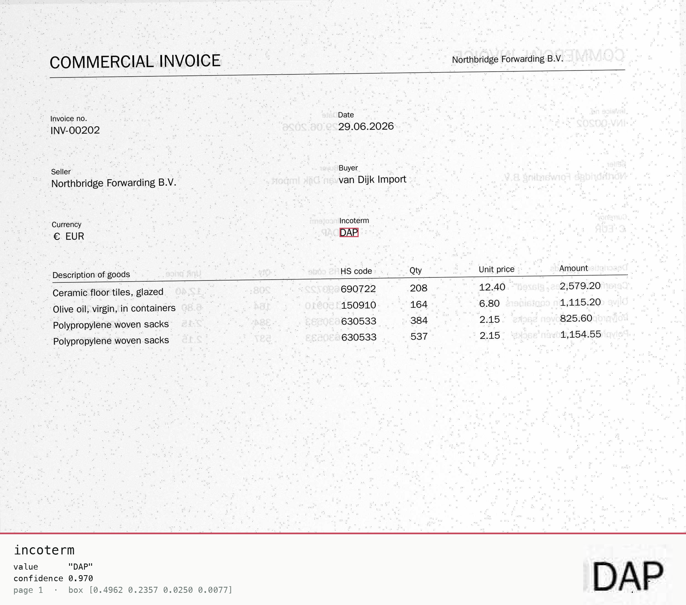<br>
  <sub><b>The record said <code>incoterm</code> was at
  <code>[0.4962 0.2357 0.0250 0.0077]</code> on page 1, and it was</b> — the box drawn here is the
  <i>reader's</i>, not the generator's, so it is the claim the system would have to defend rather
  than the generator agreeing with itself. Note the mirrored text bleeding through from the reverse
  of the sheet, and the speckle: this is what the corpus generator considers a normal page. Right
  of the rule is the crop the provenance gate actually re-reads, at its real pixels.</sub>
</p>

Three checks of **declared and unequal strength** run on that crop: it carries ink where the
record says a value is; re-read through a *different recognition path* it agrees with the
published value; and a check-digit field that contradicts its own arithmetic is refused outright.

<p align="center">
  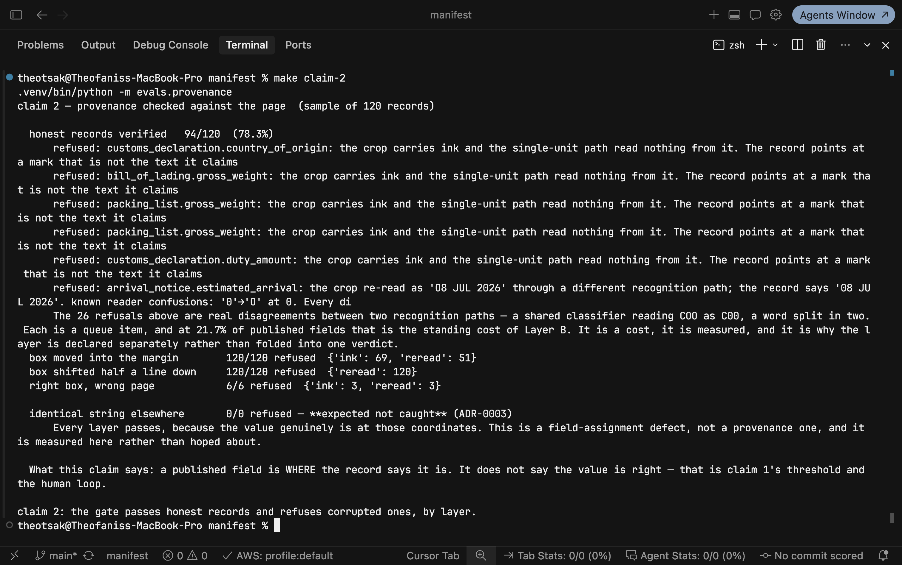<br>
  <sub><b>Each corruption refused by the layer that should catch it</b> — a box moved into the
  margin: 120/120 refused, 69 by ink and 51 by re-read. A box shifted half a line: 120/120, all by
  re-read. And the honest row: <code>identical string elsewhere</code> — <b>0/0 refused, expected
  not caught</b>. The value genuinely is at those coordinates; that is a field-assignment defect,
  not a provenance one, and it is measured here rather than hoped about.</sub>
</p>

The same claim, against the deployed estate, as two SQL statements a reviewer can read.

<table>
<tr>
<td width="50%">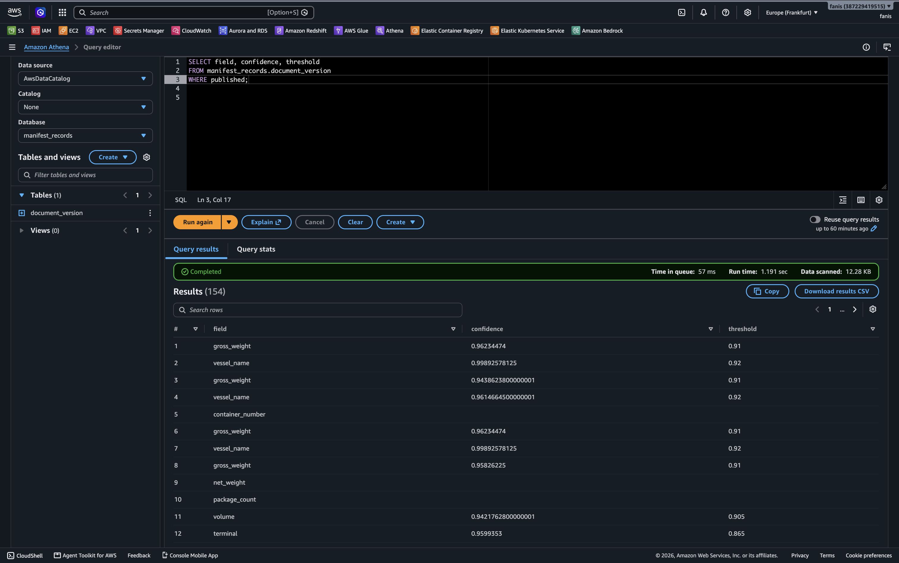<br><sub><b>154 published fields</b> — every one with the confidence it was read at and the threshold it had to clear. This take exists so the next one means something.</sub></td>
<td width="50%">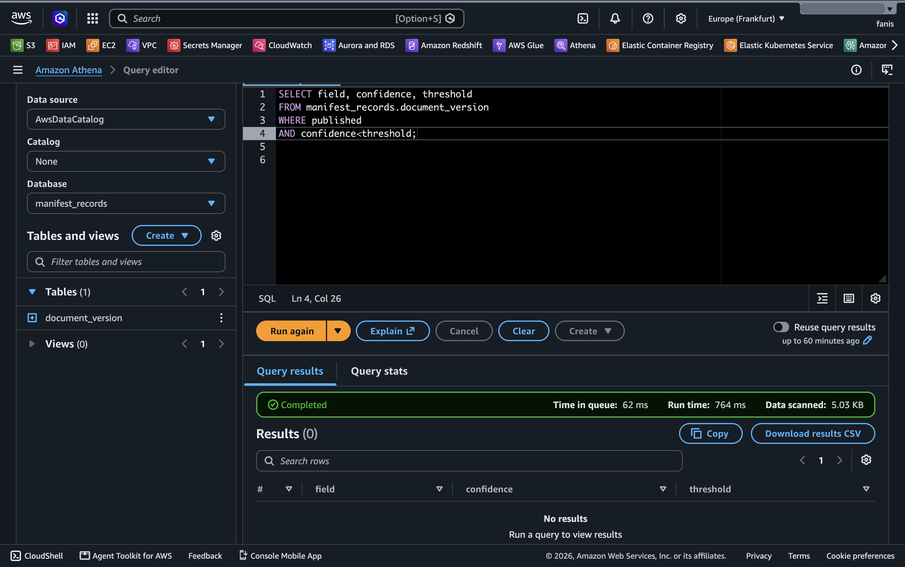<br><sub><b>Add one line, get nothing</b> — <code>AND confidence &lt; threshold</code> returns <b>0 rows</b>. Claim 1, as a query, against the estate rather than against a fixture.</sub></td>
</tr>
</table>

---

## The human loop is real, and measured

A field below its threshold cannot publish without a recorded human decision. That much is
common. What is not: **the review queue is a declared finite resource, and exceeding it fails the
build.**

<p align="center">
  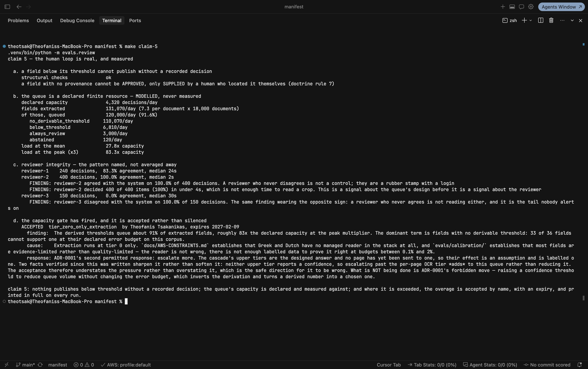<br>
  <sub><b>27.8× capacity at the mean, 83.3× at the peak</b> — declared 4,320 decisions/day against
  120,000 queued. The gate fires. It passes only on an acceptance signed by name that
  <b>expires 2027-02-09</b>, and the finding is printed in full on every run. Below it,
  reviewer integrity: <code>reviewer-2</code> at 100% agreement and a 2s median is named a rubber
  stamp; <code>reviewer-3</code> at 0% agreement is <i>the same finding wearing the opposite
  sign</i>.</sub>
</p>

For a reviewer's decision to be evidence later, the system has to record what the machine believed
at the moment it asked.

<p align="center">
  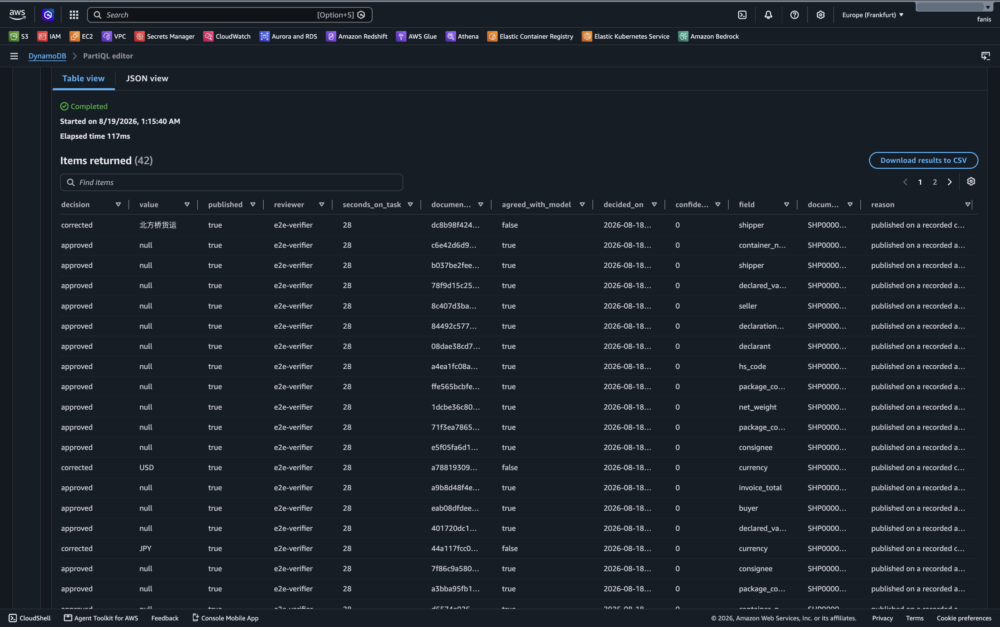<br>
  <sub><b>Three columns most systems never write</b> — <code>confidence</code> is what the model
  thought when it queued the item, <code>seconds_on_task</code> is how long the human looked, and
  <code>agreed_with_model</code> is whether they pushed back. The top row is a correction to
  <code>北方桥货运</code>: the tier-0 reader has no data for Chinese, it did not guess, and a person
  supplied the value. Without these three columns, no oversight measurement is possible at all.</sub>
</p>

Downstream, that requirement is visible as an absence.

<table>
<tr>
<td width="50%">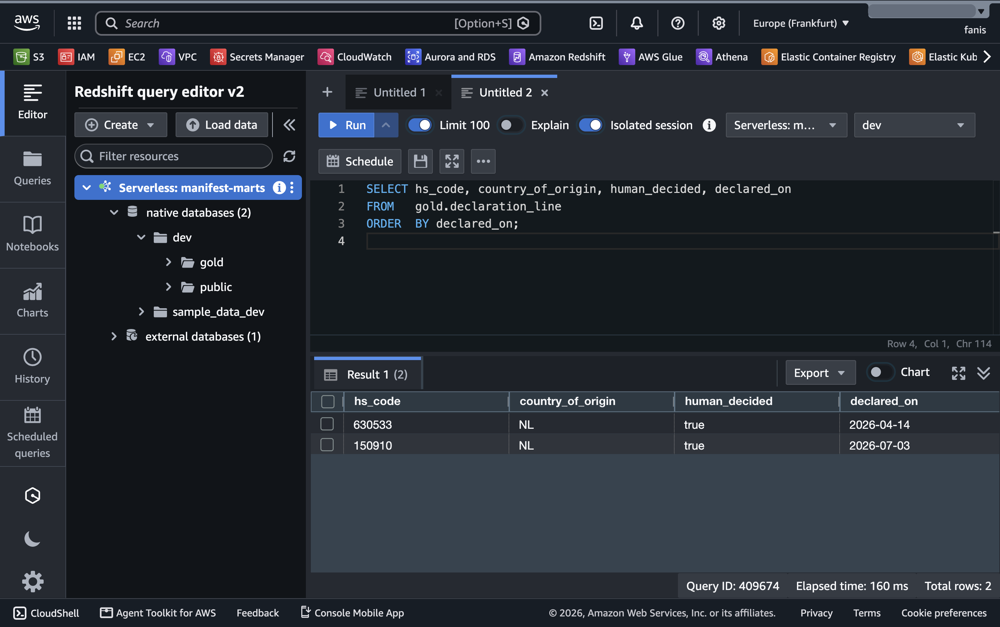<br><sub><b>Every duty line in the warehouse</b> — olive oil and woven sacks, <code>human_decided</code> <b>true</b> on both. A tariff code reaches this table only after a person approved it.</sub></td>
<td width="50%">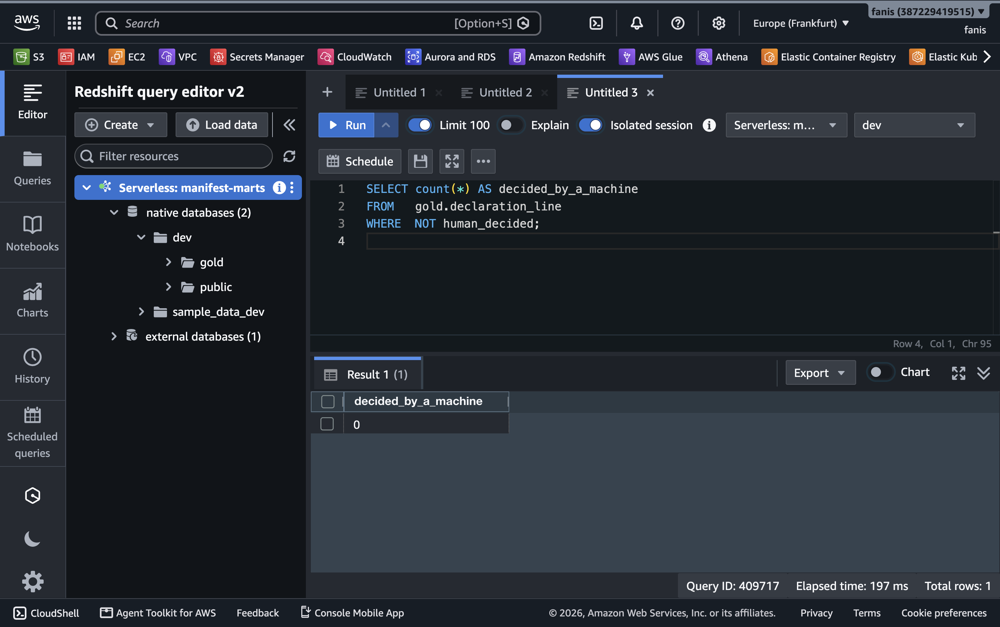<br><sub><b>And the count of the other kind</b> — <code>WHERE NOT human_decided</code> returns <b>0</b>. A wrong classification is quantifiable financial and legal exposure, so there is no path that produces one on a model's say-so.</sub></td>
</tr>
</table>

---

## A correction never erases

A human decision produces a **new version** that points at the one it replaces. Both stay
retrievable, and the reader identity carries the fact that a person was involved.

<p align="center">
  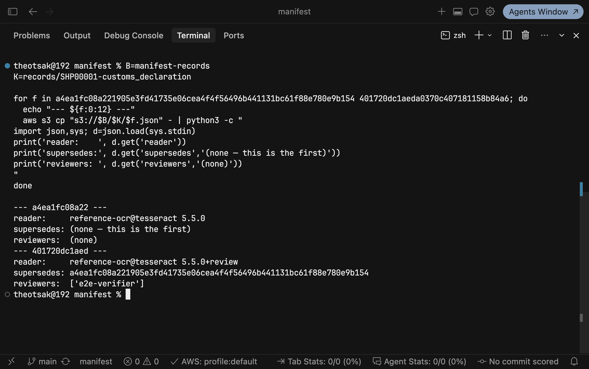<br>
  <sub><b>The same document, twice</b> — the machine's version has no <code>supersedes</code>. The
  second reads <code>reference-ocr@tesseract 5.5.0<b>+review</b></code>, points at the first by
  fingerprint, and names its reviewer. Nothing was overwritten; a re-extraction writes <i>beside</i>
  the old record.</sub>
</p>

The state machine is where that rule is enforced, and where the branch that used to be missing now
sits.

The state machine is where that rule is enforced. Below is the **same machine three times**,
with a different execution lit up in each — the dimmed states are the ones that document did not
enter. A document is not "correct" or "failed": it takes one of three routes, and which one is
the system's actual output.

<p align="center">
  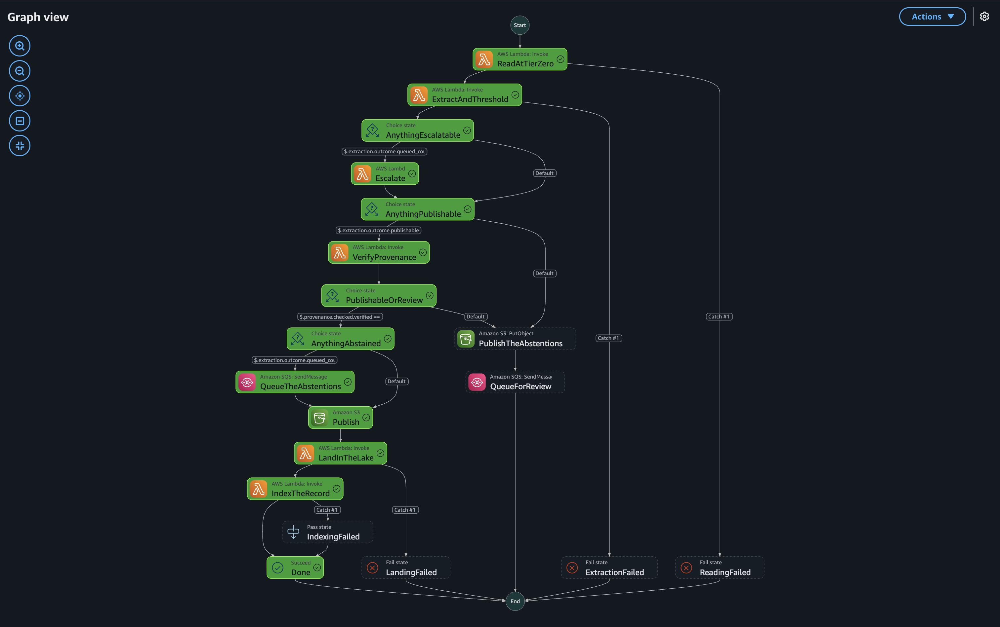<br>
  <sub><b>One · it published, and still owed the rest to a human</b> —
  <code>VerifyProvenance</code> sits <i>before</i> <code>Publish</code>, so it is a gate rather
  than an audit. And <code>QueueTheAbstentions</code> runs on the same path as
  <code>Publish</code>: this document published some fields and sent the others to review in a
  single execution. The right-hand branch is dark; it was never entered.</sub>
</p>

<p align="center">
  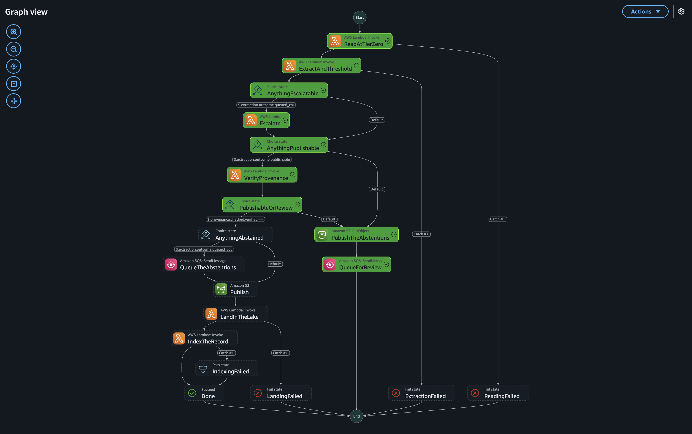<br>
  <sub><b>Two · it abstained on everything, and the run still succeeded</b> — the left column is
  dark now. <code>PublishTheAbstentions → QueueForReview</code> is lit instead, and there is no
  <code>Publish</code>, no <code>LandInTheLake</code>, no <code>IndexTheRecord</code>. A record is
  still written, because a reviewer's decision needs something to supersede. This branch was
  missing once: <code>Publish</code> and <code>QueueForReview</code> excluded each other, and a
  document that published part of itself sent nobody the rest.</sub>
</p>

<p align="center">
  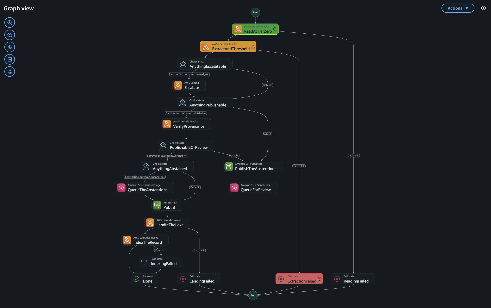<br>
  <sub><b>Three · it was refused, deliberately</b> — <code>ExtractAndThreshold</code> carries the
  warning marker and the run ends red at <code>ExtractionFailed</code>. Nothing downstream ran.
  Three of the thirty-four end-to-end checks are documents that <i>must</i> be refused, and the
  property they assert is not that the execution failed — every execution reaches some terminal
  state — but that <b>no record was published</b>. An earlier version asserted the former and
  passed on documents that sailed through.</sub>
</p>

Across documents, disagreement is surfaced rather than smoothed.

<p align="center">
  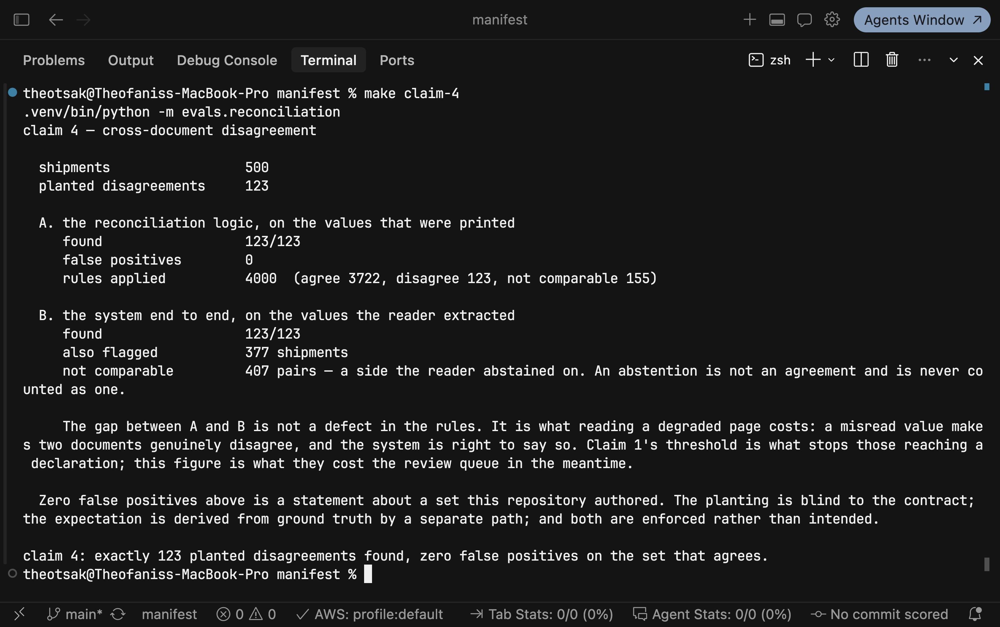<br>
  <sub><b>123/123 found, 0 false positives</b> — and the sentence under it is the one that matters:
  <i>the planting is blind to the contract; the expectation is derived from ground truth by a
  separate path.</i> A generator that read the reconciliation rules to decide what to break, and a
  detector that read the same rules to find it, would be one function agreeing with itself.</sub>
</p>

---

## The cascade, and what it may not claim

Four tiers. The bottom one is a local open-source reader that runs identically on a laptop and in
the deployed estate, from the same container image — which is what makes claims 1 and 2 checkable
without an AWS account.

<p align="center">
  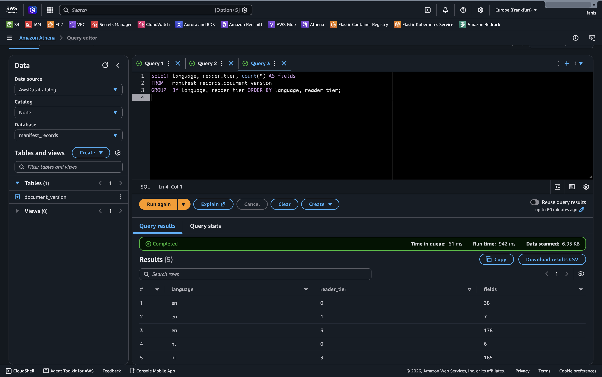<br>
  <sub><b>Dutch never reaches tier 1</b> — <code>nl</code> appears at tier 0 and tier 3 and nowhere
  else, because the managed per-page reader does not carry it and the routing contract sends it
  straight to the only tier that does. That is the contract as executed, not a diagram.</sub>
</p>

What the model tier actually did is in the estate's own telemetry, per document.

<p align="center">
  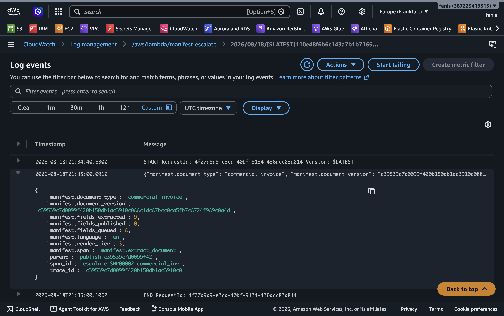<br>
  <sub><b>One span, and the two numbers that matter are beside each other</b> —
  <code>reader_tier: 3</code>, so this document went to the language model; then
  <code>fields_extracted: 9</code>, <code>fields_published: 0</code>,
  <code>fields_queued: 8</code>. The model read nine fields and published none of them. It is the
  only tier that reads Greek and Dutch, it reports no confidence at all, and any it is asked for
  is refused at the adapter — a self-reported score is a token the prompt made likely, not a
  measured frequency.</sub>
</p>

Above the readers, a classifier proposes tariff codes. It is allowed to rank. It is not allowed to
decide.

<p align="center">
  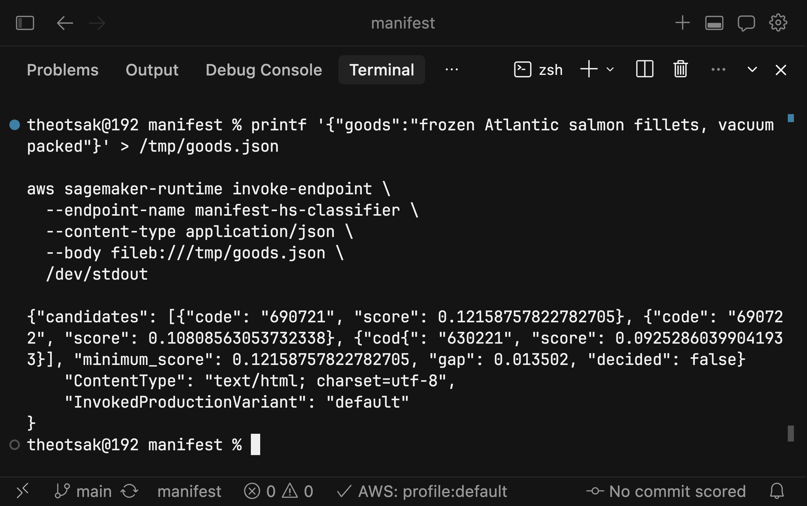<br>
  <sub><b>Asked about frozen salmon, it proposed ceramic tiles — and nothing was published</b>.
  The top two candidates are <code>0.0135</code> apart, the contract calls that contested, and
  <code>"decided": false</code>. The system did not catch the error by knowing about fish; it
  caught it because a margin that small is not a decision.</sub>
</p>

Cost is a **model**, and the schema is built so nobody can quote it as anything else.

<p align="center">
  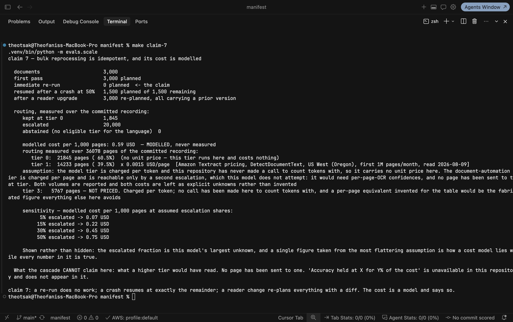<br>
  <sub><b>0.59 USD per 1,000 pages — <i>modelled</i></b>. Routing measured over 36,078 recorded
  pages; tier 0 at 60.5% with no unit price because it costs nothing; tier 1 priced from a dated,
  cited pricing page. Tier 3 is <b>NOT PRICED</b>: it bills per token, no call has been made to
  count tokens with, and a per-page equivalent invented for the table would be the fabricated
  figure everything else here avoids. The sensitivity rows are shown because the escalated
  fraction is this model's largest unknown.</sub>
</p>

Those figures reach a warehouse under a column name chosen so nobody can quote them as
anything else.

<p align="center">
  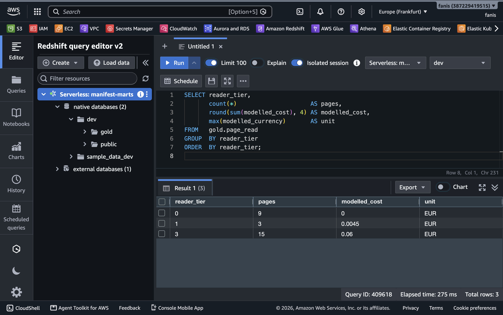<br>
  <sub><b>The column is called <code>modelled_cost</code></b> — tier 0 read nine pages for
  <b>0.0000 EUR</b> because it runs in the same image on a laptop and in the estate; tier 3 read
  fifteen for <b>0.0600</b>. The cascade exists for that ratio. Naming the column this way is not
  documentation — it is the schema refusing to let a modelled number be reported as a measured
  one.</sub>
</p>

The sentence this repository will not write is *"accuracy held at X for Y% of the cost"*. The
upper tiers have been called but never scored, so there is no accuracy figure for the escalated
fraction. What the cascade proves is narrower and is stated as such: the routing rule sends
low-confidence pages up, and the pages it keeps at tier 0 meet their fields' error budgets.

---

## The gates are attacked

Every gate in this repository is broken on purpose and required to refuse — **by name, and for the
right reason**. A mutation whose target has moved reports `STALE`, never `passed`.

<p align="center">
  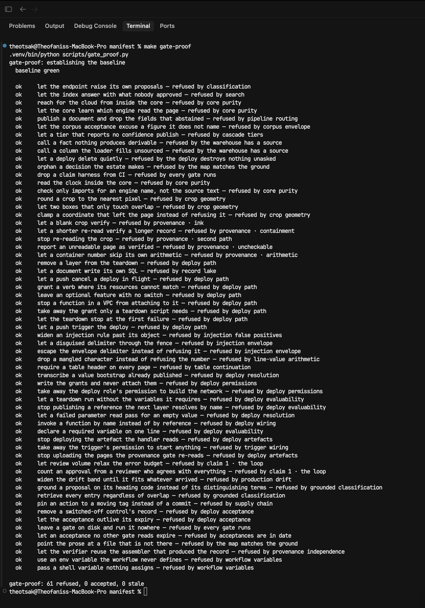<br>
  <sub><b>57 refused, 0 accepted, 0 stale</b> — and read the mutation names, not the count.
  <i>let review volume relax the error budget</i> is the forbidden move from ADR-0001 planted as
  code. <i>count an approval from a reviewer who agrees with everything</i> plants a rubber stamp
  into the feedback loop. <i>grant a verb where its resources cannot match</i> was a real defect in
  this repository, found by a teardown, before it became a test.</sub>
</p>

Each of the seven claims has its own command, and so does every rule that supports them.

<p align="center">
  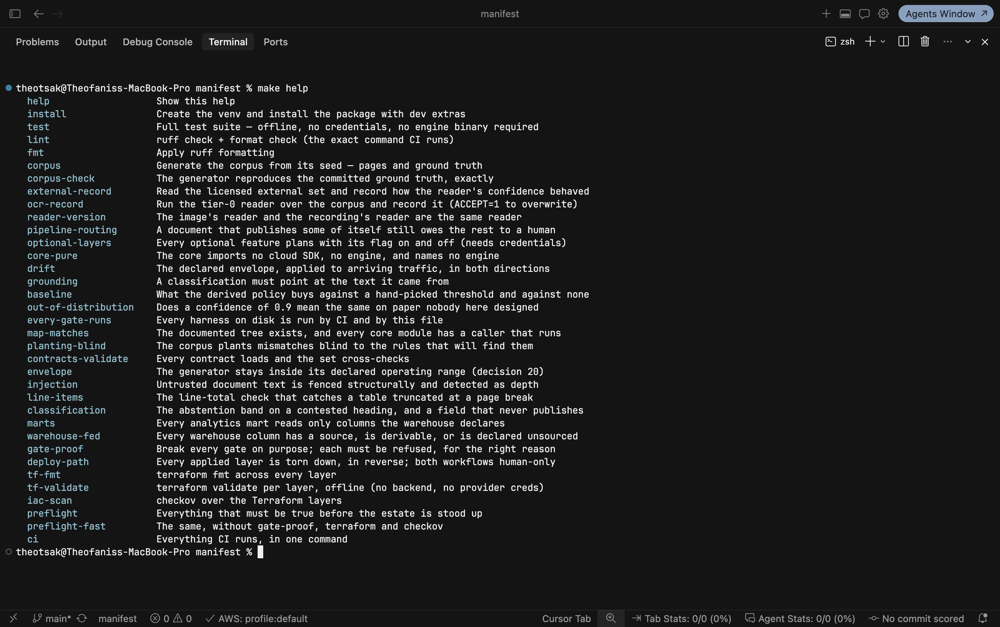<br>
  <sub><b>Thirty-six targets, every one an argument</b> — <code>core-pure</code>,
  <code>planting-blind</code>, <code>out-of-distribution</code>, <code>every-gate-runs</code>,
  <code>map-matches</code>. If a claim in this README has no command beside it, it is not a claim
  this repository makes.</sub>
</p>

---

## Quickstart

Requires Python 3.12+ and `make`. No AWS account, no credentials, no network.

```bash
# 1. Install into a local virtualenv
make install

# 2. The seven claims, each with its own harness
make claim-1   # thresholds derived from error budgets, with N and ECE
make claim-2   # every published field checked against the page
make claim-5   # the queue's capacity, and reviewer integrity

# 3. Break every gate on purpose — each must be refused by the named gate
make gate-proof

# 4. Everything CI runs, in one command
make ci
```

The corpus is not committed — 3,255 rendered pages regenerate byte-identically from one seed with
`make corpus`, and `make corpus-check` proves they do. Deploying is a separate, deliberate act:
`deploy.yml` and `destroy.yml` are `workflow_dispatch` only and are described in
[`docs/DAY-ONE.md`](docs/DAY-ONE.md).

---

## Testing

**502 tests** — offline, credential-free, and requiring no engine binary. They cover the pure core
(threshold derivation, reconciliation, entity resolution, versioning, drift, feedback), the
contract loader, the engine adapters against documented response schemas, the handlers, and every
gate.

They deliberately do **not** cover: the accuracy of any reader, which is what `evals/` measures
against a labelled set; and live AWS behaviour, which is what
[`scripts/e2e_verify.py`](scripts/e2e_verify.py) checks against a deployed estate and which
therefore needs credentials.

```bash
make test        # the suite
make lint        # ruff check + format check, the exact command CI runs
make preflight   # everything that must be true before the estate is stood up
```

The figures this README quotes are the figures those commands print, and a check enforces it.
`make preflight` runs **37 checks**, one of which re-reads this file: the test suite at
**502 passing**, `gate-proof` at **57 refused, 0 accepted, 0 stale**, and checkov at
**718 passed, 0 findings** across six Terraform layers. A scoreboard drifts by the ordinary act of
adding a gate, silently, in the direction of looking more finished than it is — so the repository
whose first claim is that every number is reproducible is the one that has to check.

CI ([`.github/workflows/ci.yml`](.github/workflows/ci.yml)) runs eight jobs on every push: the
suite, the 15 claim harnesses, the 57 gate mutations, `terraform validate` against real provider
schemas, checkov at zero findings, a secret scan, the reader image build, and a full corpus
regeneration that proves the committed ground truth reproduces.
[`scripts/check_every_gate_runs.py`](scripts/check_every_gate_runs.py) compares the `evals/`
directory against what CI and the Makefile actually invoke, because three hand-maintained lists of
"what proves this repository" had already drifted once.

---

## Repository layout

| Path | Purpose |
|---|---|
| [`contracts/`](contracts/) | **The source of truth.** YAML: document fields with error budgets, reconciliation rules, the party model, cascade routing. Never imported by name |
| [`corpus/`](corpus/) | The generator, the committed ground truth, and [`envelope.yaml`](corpus/envelope.yaml) — the declared operating range a drifting generator fails against |
| [`src/manifest/core/`](src/manifest/core/) | **Pure.** Every decision the system makes, as functions over plain data. No boto3, no engine, no engine names — enforced by `make core-pure` |
| [`src/manifest/extraction/`](src/manifest/extraction/) | Engine adapters producing one normalised representation. `local/` runs; `aws/` is schema-tested |
| [`src/manifest/handlers/`](src/manifest/handlers/) | The 14 functions that run in the estate. They may import boto3, they call `core`, and they decide nothing |
| [`src/manifest/gates/`](src/manifest/gates/) | One module per claim |
| [`evals/`](evals/) | The 15 claim harnesses — labelled, credential-free |
| [`recordings/`](recordings/) | Golden engine output. Every threshold derives from here, never from a live run |
| [`infra/`](infra/) | Six Terraform layers. `bootstrap/` applies from a laptop; the other five only from CI |
| [`scripts/`](scripts/) | `gate_proof.py`, `preflight.py`, `e2e_verify.py`, `estate_sweep.py`, and the checks that read the repository about itself |
| [`docs/`](docs/) | Scenario, regulatory posture, decisions, ADRs |

---

## What this does not do

- **The corpus is generated, and every confidence in claims 1 and 2 comes from a real reader on
  generated paper.** The one exception is `evals/external`: 100 pages of genuinely photographed
  documents nobody here designed, where ECE is **0.0592** against **0.0815** on the generated set
  — the reader is *better* calibrated on paper it has never seen. That transport is the only
  answer to *"did you tune the generator until the claims passed?"* that does not come from the
  generator's author, and it is the answer that would have been worth suppressing if the numbers
  had gone the other way.
- **No accuracy figure exists for the escalated fraction, and cannot yet.** Tier 1 has been called
  (2,336 pages), tier 2 once, tier 3 on a handful of documents. Calls are not measurements.
- **Tier 2 returns a per-word confidence that its published schema says it does not return.** The
  schema is what had been checked. Nothing publishes on that score — not because the number is
  absent, but because no threshold is derived from it.
- **No distributed job has ever executed.** The `batch` layer applies and tears down; claim 7 is
  proved by a pure planner and its ledger on a laptop, and the EMR layer is an adapter over that
  planner rather than the thing being proved.
- **A document that abstains on every field never reaches the lake.** Its branch ends at
  `PublishTheAbstentions → QueueForReview`, with no `LandInTheLake`. The record and the queue item
  both exist; the analytics layer undercounts abstention by exactly the hardest documents. Found
  on 19 August 2026 by querying the estate, not by a test.
- **`provenance_verified` conflates "the gate refused" with "the gate does not apply".** A field
  published from a human decision carries `false`, because re-reading the crop would not agree
  with a value a person supplied. The obvious query therefore reports 121 published fields without
  verified provenance, and the correct one — restricted to machine-published fields — reports zero.
- **The warehouse loads before any document exists.** On a fresh estate the marts are empty until a
  second deploy runs the load again. The loader refuses to call that a successful load, which is
  right, but the ordering is still a defect.
- **The reviewer data in a deployed run is a synthetic harness identity** at 92.9% agreement across
  two distinct time-on-task values. Reviewer integrity is proved offline in `make claim-5`, where
  three modelled reviewers have three distinct pathologies; the estate proves the *columns* exist,
  not that oversight was good.
- **The reader image carries CRITICAL CVEs in its Debian base packages, and nothing gates them.**
  checkov scans Terraform to zero findings; no check reads the ECR image scan. Both base images
  are now pinned to a digest and both are built by CI, so the input is fixed and the build is
  checked — but the advisories against those pinned bases are still nobody's gate.
- **`security/injection.py` has no caller in the running system.** The fence that carries the
  weight today is structural and elsewhere: `handlers/escalate.py` sends the page as an image, so
  document text never enters a prompt as text. The module is the fence for a text path that does
  not exist yet, it is proved by `evals/injection`, and its absence of a caller is *declared*
  in `contracts/core/reachable.yaml` with an expiry rather than left to be discovered.
- **Required reviewers on the deploy environment are off**, under a dated acceptance that expires
  and that `check_deploy_path.py` refuses to let outlive its expiry
  ([`contracts/deploy/acceptance.yaml`](contracts/deploy/acceptance.yaml)).
- **The budget guard measured the whole account rather than this project**, fired on a sibling
  project's spend, and stopped this estate being deployable. The ceiling was raised under a dated
  acceptance ([`contracts/deploy/budget.yaml`](contracts/deploy/budget.yaml)) while the cost filter
  waits on a cost-allocation-tag backfill.
- **Everything is `eu-central-1`, one run, one day.** No load testing, no concurrency testing, no
  continuously green integration environment.

---

## Cost

**Nothing is standing.** The estate exists only while a dispatch keeps it standing, and the
teardown is exercised rather than written: `destroy.yml` runs the layers in reverse, each `if:
always()`, and ends with [`scripts/estate_sweep.py`](scripts/estate_sweep.py), which sweeps twice —
by tag and by name — and exits non-zero if anything survives that is not bootstrap's.

| Figure | Basis |
|---|---|
| **$3.50** | **Measured.** Textract `DetectDocumentText` over 2,336 eligible corpus pages on 2026-08-15, at the published per-page rate |
| **0.59 USD / 1,000 pages** | **Modelled.** Routing measured over 36,078 recorded pages × published unit prices; tier 3 explicitly not priced |
| **under €150** | A **design ceiling** in [`CLAUDE.md`](CLAUDE.md), not a result. It may be quoted as a ceiling and not as an outcome |

Every resource is tagged `manifest:expires-at` with a scheduled reaper, and an AWS Budget action
detaches the deploy role's ability to create — while deliberately leaving its ability to tear
down, because an estate that cannot be destroyed because it ran out of budget is the worst of
both.

---

## Decisions

Five decision records in [`docs/adr/`](docs/adr/), and a longer running ledger in
[`docs/DECISIONS.md`](docs/DECISIONS.md) that keeps superseded entries rather than editing them —
including two revisions of the same decision on the same day, because how each went wrong is the
useful part.

| | |
|---|---|
| [0001](docs/adr/0001-abstention-is-safe-but-not-free.md) | Abstention is the safe state and is not free. Raising a threshold to reduce queue volume is forbidden; the permitted responses are more data or more escalation |
| [0002](docs/adr/0002-thresholds-are-derived-with-their-uncertainty.md) | A threshold carries its upper confidence bound and its N, or the field is always-review |
| [0003](docs/adr/0003-provenance-is-checked-against-the-page.md) | Provenance is verified against the rendered page, and each layer declares what it cannot catch |
| [0004](docs/adr/0004-the-cascade-and-the-normalised-representation.md) | One normalised representation; the core never learns which engine produced a value |
| [0005](docs/adr/0005-the-local-engine-and-its-recording.md) | Thresholds derive from a committed recording, never from a live run. Regenerating it is a ceremony that prints every movement |

---

## Docs

[SCENARIO](docs/SCENARIO.md) — the domain, document types, volumes and pathologies ·
[REGULATORY](docs/REGULATORY.md) — the legal posture, where the answer is mostly *"the AI Act does
not apply"*, and why that is the interesting part ·
[DECISIONS](docs/DECISIONS.md) — the running ledger ·
[AWS-CONSTRAINTS](docs/AWS-CONSTRAINTS.md) — what the managed services do and do not support, with
citations · [DAY-ONE](docs/DAY-ONE.md) — standing the estate up and taking it down ·
[PORTFOLIO-CONTEXT](docs/PORTFOLIO-CONTEXT.md) · [CHANGELOG](CHANGELOG.md)

Engineering rules are in [`CLAUDE.md`](CLAUDE.md).

## Security

Untrusted document text is fenced structurally before it reaches any prompt — and the README is
exact about which fence carries the weight, because they are not the same one. Today it is
`handlers/escalate.py`: the page goes to the model as an **image**, so document text never enters
the prompt as text. `security/injection.py` is the fence for a text path this system does not yet
have; its refusal reads the normalised form as well as the raw one, so a delimiter disguised by a
zero-width character is refused rather than passed. `make injection` scores it at **0 false
positives** across 2,969 documents of ordinary trade prose.

That module having no caller is declared in [`contracts/core/reachable.yaml`](contracts/core/reachable.yaml)
with an expiry, and `check_the_map_matches_the_ground.py` walks `security/` to keep it declared —
a control two documents cite and nothing calls is exactly the state three core modules were in
while their claims were being scored. Scope, reporting and known limitations are in
[SECURITY.md](SECURITY.md).

## License

[MIT](LICENSE) © 2026 Theofanis Tsakanikas
