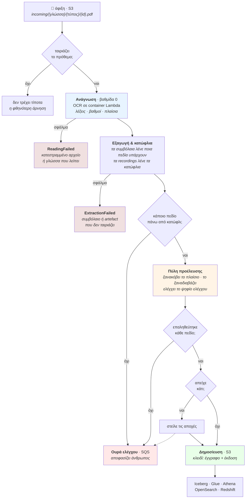
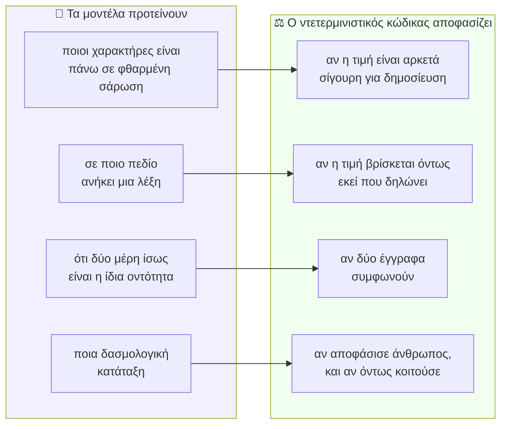
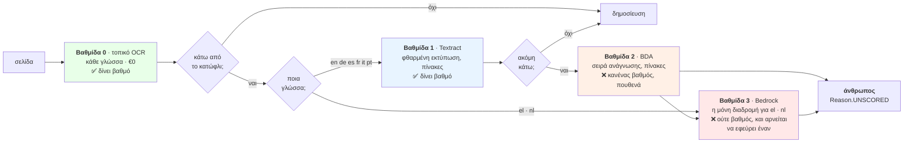
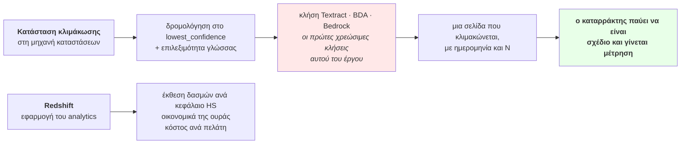

# Manifest — τι κάνει, και πού κάθεται κάθε υπηρεσία

*Γράφτηκε στις 2026-08-11, αφού το πρώτο estate εφαρμόστηκε, επαληθεύτηκε από άκρη σε άκρη και
κατεδαφίστηκε. Σκοπός του είναι να συμφωνήσουμε τη μορφή **πριν** χτιστούν οι ανώτερες βαθμίδες
του καταρράκτη.*

*Κάθε διάγραμμα εδώ επαληθεύτηκε απέναντι στον κώδικα και τα συμβόλαια που το ορίζουν — τις
καταστάσεις στο `infra/extraction/pipeline.tf`, τη δρομολόγηση στο `contracts/cascade/routing.yaml`
και τα αρθρώματα στο `src/manifest/core/`. Το αγγλικό `ARCHITECTURE.md` είναι το κανονικό
αντίγραφο· αυτό είναι η μετάφρασή του.*

---

## Σε μία παράγραφο

Ένας εκτελωνιστής παραλαμβάνει εμπορικά έγγραφα — φορτωτικές, τιμολόγια, δελτία συσκευασίας,
πιστοποιητικά καταγωγής, τελωνειακές διασαφήσεις, ειδοποιήσεις άφιξης — ως **σαρώσεις σαρώσεων**:
στραβές, με σφραγίδες πάνω από τους αριθμούς, σε τρεις γλώσσες, με πίνακες που σπάνε σε
σελίδες. Το Manifest μετατρέπει καθένα σε **δομημένη εγγραφή όπου κάθε δημοσιευμένο πεδίο
δείχνει σε ένα ορθογώνιο πάνω στη σελίδα**, ελέγχει ότι τα έγγραφα μιας αποστολής **συμφωνούν
μεταξύ τους**, και προτείνει **δασμολογική κατάταξη** που την αποφασίζει άνθρωπος. Ο μηχανικός
ισχυρισμός δεν είναι ότι η ανάγνωση είναι ακριβής. Είναι ότι **το σύστημα ξέρει τι δεν ξέρει**:
πεδίο του οποίου η εμπιστοσύνη πέφτει κάτω από κατώφλι *παραγόμενο από τον δηλωμένο
προϋπολογισμό σφάλματος εκείνου του πεδίου* δεν δημοσιεύεται ποτέ — πηγαίνει σε άνθρωπο. Και η
ουρά που το παραλαμβάνει έχει **δηλωμένη χωρητικότητα**, ώστε ένα σύστημα που απέχει υπερβολικά
να ρίχνει το ίδιο του το build αντί να πνίγει σιωπηλά τους ελεγκτές του.

---

## 1 · Τι συμβαίνει σε ένα έγγραφο

**Τρία σημεία που αξίζουν προσοχή.** Ένα έγγραφο μπορεί να **δημοσιεύσει και να στείλει σε
ουρά ταυτόχρονα** — οκτώ πεδία στην εγγραφή, τέσσερα σε άνθρωπο· το να μην το κάνει αυτό είναι
το πρώτο σφάλμα με το οποίο βγήκε το estate. Τίποτα δεν φτάνει στην εγγραφή χωρίς να περάσει την
πύλη προέλευσης, που ελέγχει το πλαίσιο απέναντι **στη σελίδα**, όχι απέναντι στην εγγραφή που
το παρήγαγε. Και οι δύο καταστάσεις αποτυχίας είναι **χωριστές επίτηδες**: έγγραφο που δεν
διαβάστηκε και έγγραφο του οποίου η εξαγωγή απέτυχε είναι διαφορετικά λειτουργικά προβλήματα,
και η συγχώνευσή τους θα τα έβαζε στον ίδιο συναγερμό κάνοντας και τα δύο μη ενεργήσιμα.

---

## 2 · Το όριο γύρω από το οποίο χτίζεται όλο το σύστημα

Τα τέσσερα ζεύγη είναι **δείγμα, όχι η πλήρης λίστα**: το `src/manifest/core/` έχει δεκαέξι
αρθρώματα και όλα κάθονται στη δεξιά στήλη. Το καθαρότερο παράδειγμα δεν είναι στο διάγραμμα —
το `checkdigit.py`, που απορρίπτει έναν αριθμό εμπορευματοκιβωτίου ISO 6346 όταν διαφωνεί με τη
**δική του αριθμητική**. Καμία εμπιστοσύνη, κανένα κατώφλι: ή το ψηφίο ελέγχου βγαίνει ή όχι.

Ό,τι είναι δεξιά είναι καθαρή Python, χωρίς κανένα SDK του σύννεφου και καμία βιβλιοθήκη
μοντέλου. Αυτό είναι που επιτρέπει **κάθε ισχυρισμό να ελέγχεται σε laptop χωρίς λογαριασμό
AWS** — και γι' αυτό η αντικατάσταση του Textract με τοπικό αναγνώστη είναι αλλαγή adapter και
τίποτε άλλο.

---

## 3 · Ο καταρράκτης — και το γεγονός που ορίζει την οικονομία του

**Μόνο οι βαθμίδες 0 και 1 δίνουν βαθμό εμπιστοσύνης.** Άρα η κλιμάκωση πέρα από τη βαθμίδα 1
δεν είναι «αγοράζω καλύτερη ανάγνωση» — είναι **απόφαση να ξοδέψεις άνθρωπο**: η σελίδα
διαβάζεται καλύτερα και επιστρέφει χωρίς βαθμό με τον οποίο να δημοσιευτεί. Δεν είναι ελάττωμα
της δρομολόγησης· είναι το τι *είναι* αυτές οι υπηρεσίες, και γι' αυτό το μοντέλο χωρητικότητας
της ουράς κοστολογείται απέναντι σε αυτό αντί για μια υπόθεση.

**Και τα ελληνικά με τα ολλανδικά παρακάμπτουν εντελώς τις βαθμίδες 1 και 2.** Το Textract, το
Bedrock Data Automation και το Comprehend τεκμηριώνουν **τις ίδιες έξι γλώσσες εισόδου**, και
ούτε τα ελληνικά ούτε τα ολλανδικά είναι ανάμεσά τους (`docs/AWS-CONSTRAINTS.md`, επαληθευμένο
2026-08-09). Για δύο από τις τρεις γλώσσες αυτού του σεναρίου — και για τη γλώσσα του γραφείου
του Πειραιά — ο τοπικός αναγνώστης δεν είναι η φθηνή επιλογή· **είναι η μόνη**.

---

## 4 · Πού κάθεται πραγματικά κάθε υπηρεσία AWS

| Υπηρεσία | Η δουλειά της | Κατάσταση σήμερα |
|---|---|---|
| **S3** | ζώνη άφιξης, εγγραφές, αποδόσεις σελίδων, λίμνη Iceberg | ✅ έτρεξε |
| **Lambda** (container) | ο αναγνώστης βαθμίδας 0 και η πύλη προέλευσης | ✅ έτρεξε |
| **Step Functions** | μία εκτέλεση ανά έγγραφο· η κλιμάκωση ανήκει εδώ | ✅ έτρεξε, ⚠️ **χωρίς κατάσταση κλιμάκωσης** |
| **SQS + DynamoDB** | η ουρά ελέγχου και οι καταγεγραμμένες αποφάσεις | ✅ έτρεξε |
| **ECR** | η εικόνα του αναγνώστη — 3,7 GB, δύο Lambda τρέχουν *από* αυτήν | ✅ έτρεξε |
| **Textract** | βαθμίδα 1, για τις έξι τεκμηριωμένες γλώσσες | ⚠️ adapter γραμμένος, **ποτέ δεν κλήθηκε** |
| **Bedrock Data Automation** | βαθμίδα 2, σειρά ανάγνωσης και πίνακες | ⚠️ adapter γραμμένος, **ποτέ δεν κλήθηκε** |
| **Bedrock** | βαθμίδα 3, η μόνη κλιμάκωση για ελληνικά και ολλανδικά | ⚠️ adapter γραμμένος, **ποτέ δεν κλήθηκε** |
| **Glue · Athena · Iceberg** | η λίμνη εγγραφών και ο κατάλογός της | ✅ εφαρμόστηκε |
| **OpenSearch** | αναζήτηση σε *δημοσιευμένες εγγραφές*, ποτέ σε ακατέργαστο κείμενο | ✅ εφαρμόστηκε |
| **Redshift** | έκθεση δασμών ανά κεφάλαιο HS, οικονομικά της ουράς, κόστος ανά πελάτη | ⚠️ προαιρετικό, **ποτέ δεν εφαρμόστηκε** |
| **EMR Serverless** | μαζική επανεξαγωγή όταν βελτιωθεί ο αναγνώστης | ⚠️ προαιρετικό, ποτέ δεν εφαρμόστηκε |
| **SageMaker** | μόνο προαιρετικά | ⚠️ ποτέ δεν εφαρμόστηκε |

---

## 5 · Τι αποδείχθηκε, και τι όχι

**Αποδείχθηκε στο αναπτυγμένο estate, 2026-08-11**, από το `scripts/e2e_verify.py` — **13 από 13
ελέγχους**. Μια φορτωτική έφτασε, διαβάστηκε σε 53 λέξεις με γνήσιες εμπιστοσύνες από **0,179 έως
0,969** και πλαίσιο για την καθεμία· δύο πεδία πέρασαν τα κατώφλια τους και επτά απείχαν· η πύλη
επαλήθευσε **και τα δύο δημοσιευμένα πεδία κόβοντας τη σελίδα και διαβάζοντάς τη ξανά**· η
εγγραφή γράφτηκε με κλειδί έγγραφο και έκδοση· και **και οι επτά αποχές έφτασαν στην ουρά**.
Πέντε ακραίες περιπτώσεις απορρίφθηκαν ονομαστικά.

**Δεν αποδείχθηκε, και ο λόγος είναι ο ίδιος για όλα:** καμία διαχειριζόμενη υπηρεσία εξαγωγής
δεν κλήθηκε ποτέ. Δεν υπάρχει νούμερο ακρίβειας για το κλιμακούμενο κλάσμα και **δεν μπορεί να
υπάρξει** μέχρι μια σελίδα να ανέβει βαθμίδα. Καμία κατανεμημένη εργασία δεν έτρεξε. Κάθε νούμερο
κόστους είναι **μοντελοποιημένο** από δημοσιευμένες τιμές, ποτέ μετρημένο.

---

## 6 · Τι χτίζουμε μετά, και γιατί είναι το ζητούμενο

Σήμερα το estate επιδεικνύει τη **βαθμίδα 0 από άκρη σε άκρη και τίποτα πάνω από αυτήν**. Ο
κανόνας δρομολόγησης είναι πραγματικός και αποδεικνύεται offline πάνω στο corpus· αυτό που δεν
συνέβη ποτέ είναι μια σελίδα να ανέβει στ' αλήθεια. Η πρόταση *«οι ανώτερες βαθμίδες είναι
γραμμένες και ποτέ δεν κλήθηκαν»* είναι ειλικρινής και **αδύναμη**. Η πρόταση *«μια σελίδα
κλιμακώθηκε αυτή την ημερομηνία, και να τι κόστισε»* είναι αυτή που αξίζει — και απέχει λίγα
σεντ Textract.

Το Redshift είναι το ίδιο επιχείρημα για το αναλυτικό μισό: τα `contracts/` δηλώνουν τα marts και
το `scripts/check_marts.py` αποδεικνύει offline ότι διαβάζουν μόνο στήλες που η αποθήκη έχει. Το
να σηκωθεί το workgroup για μία ώρα μετατρέπει αυτό από σχέδιο σε απαντημένο ερώτημα — με
περίπου **€2,90 την ώρα**, που είναι ακριβώς ο λόγος που είναι προαιρετικό και παραμένει.
