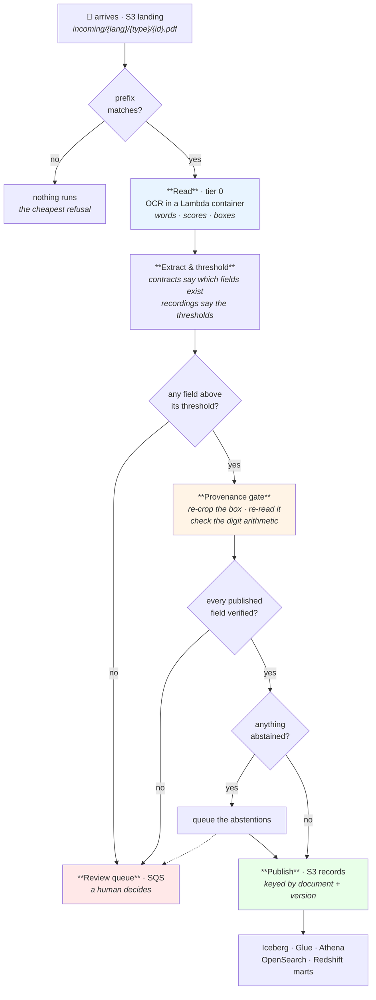
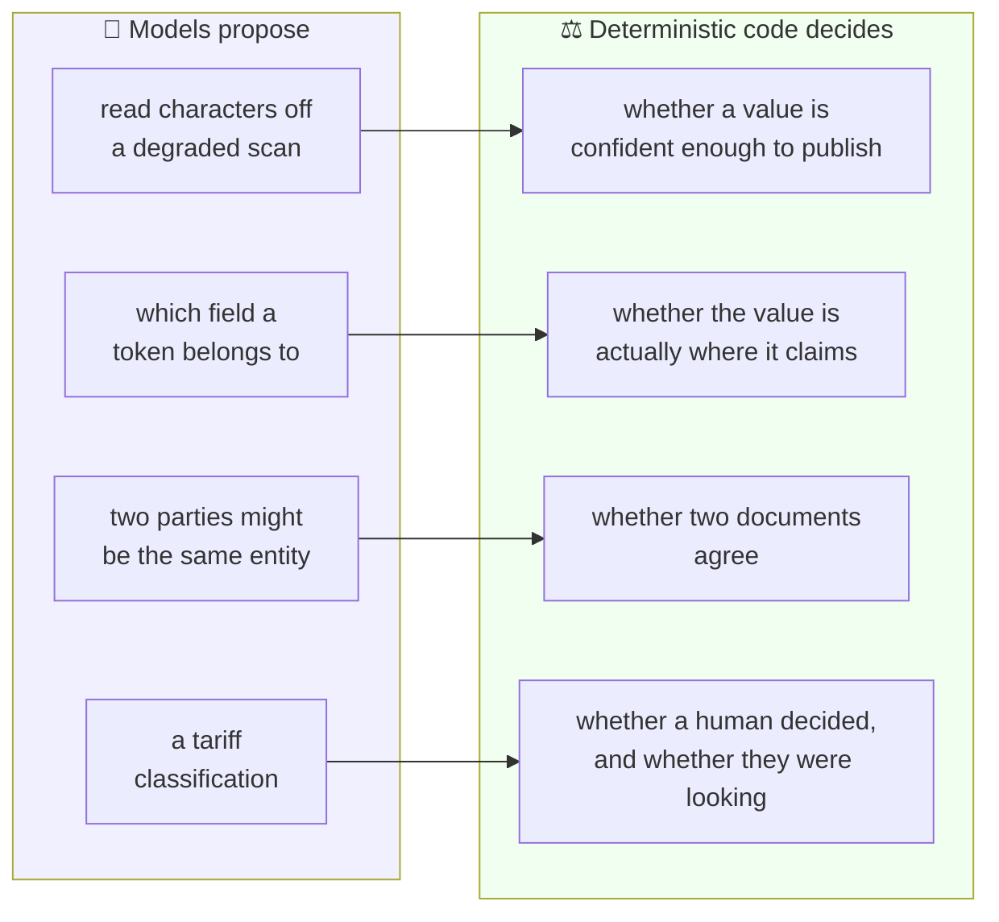
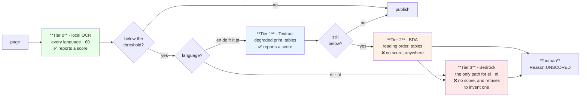
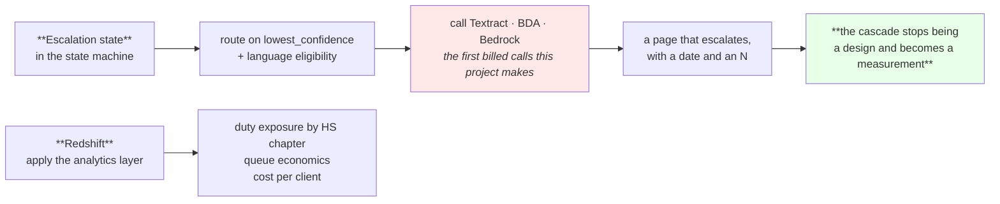

# Manifest — what it does, and where each service sits

*Written 2026-08-11, after the first estate was deployed, verified end to end and torn down.
Its purpose is to agree the shape **before** the upper tiers of the cascade are built.*

---

## In a paragraph

A customs broker receives commercial documents — bills of lading, invoices, packing lists,
certificates of origin, customs declarations, arrival notices — as scans of scans: skewed,
stamped over the numbers, in three languages, with tables that break across pages. Manifest
turns each one into **a structured record where every published field points at a rectangle on
a page**, checks that the documents in a shipment **agree with each other**, and proposes a
**tariff classification** that a human decides. The engineering claim is not that the reading is
accurate. It is that the system knows what it does not know: a field whose confidence falls
below a threshold *derived from that field's declared error budget* is never published, it is
sent to a person — and the queue that receives it has a declared capacity, so a system that
abstains too often fails its own build rather than quietly drowning its reviewers.

---

## 1 · What happens to one document

**The two things worth noticing.** A document can publish *and* queue at the same time — eight
fields to the record, four to a human — and getting that wrong is how the estate first shipped.
And nothing reaches the record without passing the provenance gate, which checks the box against
the **page**, not against the record that produced it.

---

## 2 · The boundary the whole system is built around

Everything on the right is pure Python in `src/manifest/core/`, importing no cloud SDK and no
model library. That is what lets every claim be checked on a laptop with no AWS account — and
it is why swapping Textract for a local reader is an adapter change and nothing else.

---

## 3 · The cascade — and the fact that decides its economics

**Only tiers 0 and 1 report a confidence.** So escalating past tier 1 is not "buying a better
reading" — it is **a decision to spend a human**: the page gets read better and arrives with no
score to publish it on. That is not a defect in the routing; it is what those services are, and
it is why the review capacity model is costed against it rather than against an assumption.

**And Greek and Dutch skip tiers 1 and 2 entirely.** Textract, Bedrock Data Automation and
Comprehend all document the same six input languages, and neither Greek nor Dutch is among them
(`docs/AWS-CONSTRAINTS.md`, verified 2026-08-09). For two of this scenario's three languages,
the local reader is not the cheap option — **it is the only one**.

---

## 4 · Where the AWS services actually sit

| Service | Its job | Status today |
|---|---|---|
| **S3** | landing zone, records, renders, Iceberg lake | ✅ running |
| **Lambda** (container) | the tier-0 reader and the provenance gate | ✅ running |
| **Step Functions** | one execution per document; the escalation belongs here | ✅ running, ⚠️ no escalation state |
| **SQS + DynamoDB** | the review queue and the recorded decisions | ✅ running |
| **ECR** | the reader image — 3.7 GB, two functions run *from* it | ✅ running |
| **Textract** | tier 1, for the six documented languages | ⚠️ adapter written, never called |
| **Bedrock Data Automation** | tier 2, reading order and tables | ⚠️ adapter written, never called |
| **Bedrock** | tier 3, the only escalation for Greek and Dutch | ⚠️ adapter written, never called |
| **Glue · Athena · Iceberg** | the record lake and its catalogue | ✅ applied |
| **OpenSearch** | search over *published records*, never raw document text | ✅ applied |
| **Redshift** | duty exposure by HS chapter, queue economics, cost per client | ⚠️ opt-in, never applied |
| **EMR Serverless** | bulk re-extraction when the reader improves | ⚠️ opt-in, never applied |
| **SageMaker** | opt-in only | ⚠️ never applied |

---

## 5 · What was proved, and what was not

**Proved on the deployed estate, 2026-08-11**, by `scripts/e2e_verify.py` — 13 of 13 checks. A
bill of lading arrived, was read into 53 words with genuine confidences from 0.179 to 0.969 and
a box for each, two fields cleared their thresholds and seven abstained, the gate verified both
published fields **by cropping the page and reading it again**, the record was written keyed by
document and version, and all seven abstentions reached the queue. Five edge cases were refused
by name.

**Not proved, and the reason is the same for all of it:** no managed extraction engine has ever
been called. There is no accuracy figure for the escalated fraction and there cannot be one
until a page goes up a tier. No distributed job has run. Every cost figure is **modelled** from
published prices, never measured.

---

## 6 · What we build next, and why it is the point

Today the estate demonstrates tier 0 end to end and nothing above it. The routing rule is real
and proved offline against the corpus; what has never happened is a page actually going up. The
sentence *"the upper tiers are written and have never been called"* is honest and weak. The
sentence *"a page escalated on this date, and here is what it cost"* is the one worth having —
and it is a few cents of Textract away.

Redshift is the same argument for the analytics half: `contracts/` declares the marts and
`scripts/check_marts.py` proves they only read columns the warehouse has, offline. Standing the
workgroup up for an hour turns that from a design into an answered question — at roughly €2.90
an hour, which is why it is opt-in and stays opt-in.
