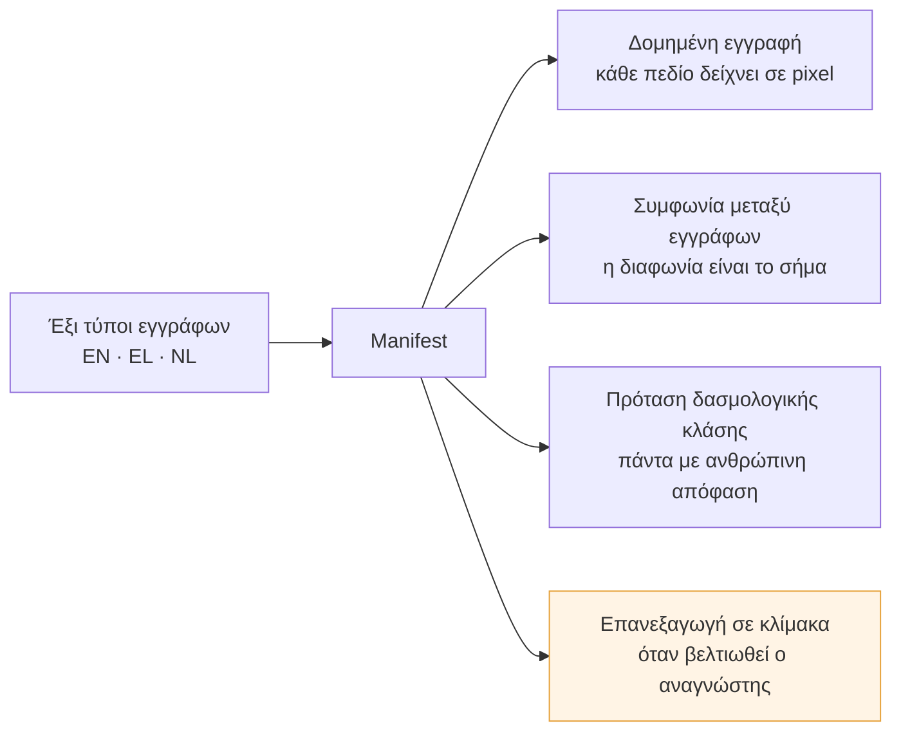
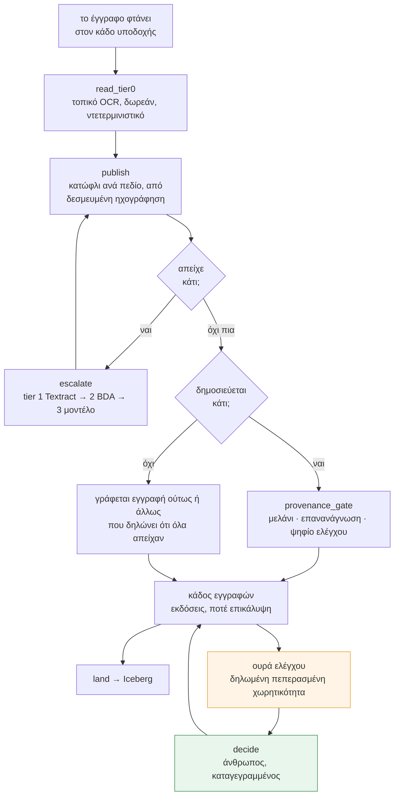
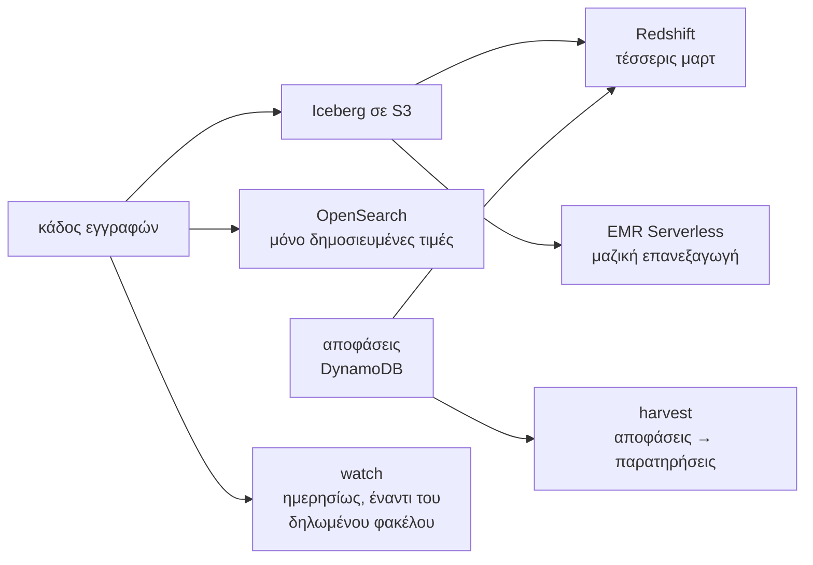
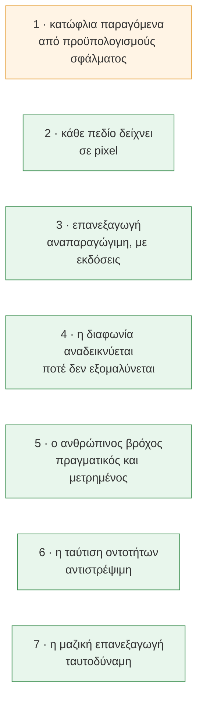
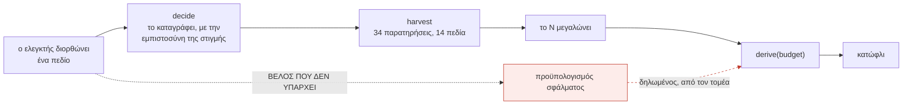
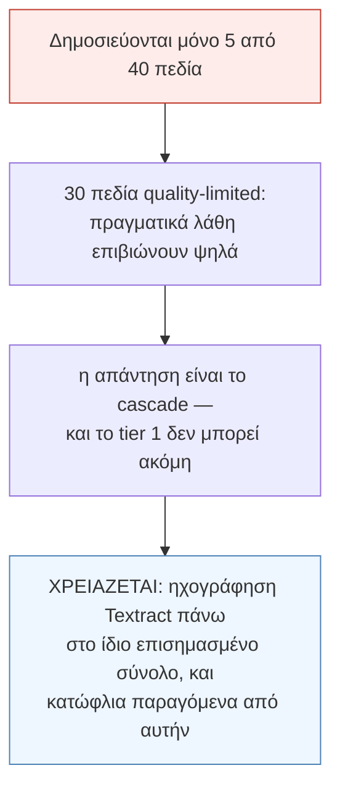
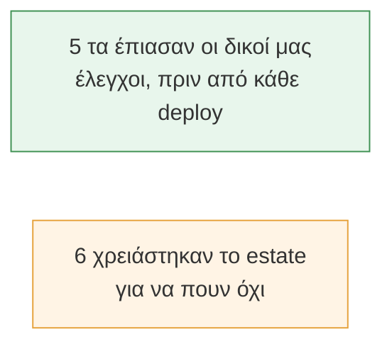
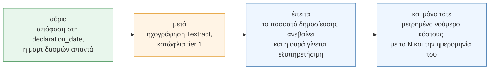

# Manifest — πού βρίσκεται

*14 Αυγούστου 2026. Γραμμένο αφού το estate σηκώθηκε, επαληθεύτηκε από άκρη σε άκρη και
κατεδαφίστηκε. Κάθε νούμερο παρακάτω το παρήγαγε εντολή αυτού του repository, και το δεύτερο
μισό του κειμένου είναι ό,τι **δεν** έχει τελειώσει.*

---

## 1 · Τι είναι το σύστημα

Ένας εκτελωνιστής παραλαμβάνει έξι είδη εμπορικών εγγράφων ως σαρώσεις σαρώσεων — στραβές,
σφραγισμένες πάνω στους αριθμούς, σε τρεις γλώσσες, με πίνακες που σπάνε σε αλλαγή σελίδας.
Βγαίνουν τρία πράγματα, και το τέταρτο είναι αυτό που κανείς δεν επιδεικνύει.

Το όριο πάνω στο οποίο στηρίζεται όλος ο σχεδιασμός: **τα μοντέλα διαβάζουν, ο ντετερμινιστικός
κώδικας αποφασίζει.**

```mermaid
flowchart TB
  subgraph M["Τα μοντέλα προτείνουν"]
    M1["διαβάζουν χαρακτήρες<br/>από φθαρμένη σάρωση"]
    M2["προτείνουν σε ποιο πεδίο<br/>ανήκει μια λέξη"]
    M3["προτείνουν δασμολογική κλάση"]
  end
  subgraph C["Ο κώδικας αποφασίζει"]
    C1["είναι αρκετά σίγουρο<br/>για να δημοσιευτεί"]
    C2["βρίσκεται εκεί που λέει<br/>η προέλευσή του"]
    C3["συμφωνούν δύο έγγραφα"]
    C4["κοίταζε όντως<br/>ο άνθρωπος"]
  end
  M --> C
  style C fill:#eef6ff,stroke:#4a7fb5
```

---

## 2 · Τι τρέχει, και πού

Δεκατρείς συναρτήσεις στο estate, έξι επίπεδα Terraform, ένας καθαρός πυρήνας που δεν εισάγει
κανένα SDK και δεν ονομάζει καμία μηχανή. Η διαδρομή ενός εγγράφου:

Ό,τι είναι κατάντη διαβάζει τον κάδο εγγραφών, ποτέ τον αναγνώστη:

---

## 3 · Οι επτά ισχυρισμοί, και τι έδειξε ο καθένας

| # | Τι δείχθηκε, στο estate |
|---|---|
| **1** | 5 κατώφλια παρήχθησαν, 1 πάντα-σε-έλεγχο από συμβόλαιο, **4 evidence-limited, 30 quality-limited** — κάθε νούμερο με το N του. Ο μόνος ισχυρισμός μισο-πράσινος, και το §5 λέει γιατί |
| **2** | Κάθε δημοσιευμένο κουτί φέρει μελάνι· η επανανάγνωση συμφωνεί· ψηφίο ελέγχου που αυτοαναιρείται αρνείται. 5 αριθμοί εμπορευματοκιβωτίου, κανένας αποδεδειγμένα λάθος |
| **3** | Τα ίδια bytes δύο φορές δεν προσθέτουν τίποτα. Η διόρθωση γράφει **νέα έκδοση δίπλα στην παλιά**, και οι δύο ανακτήσιμες |
| **4** | `SHP00001` **μηδέν** διαφωνίες · `SHP00002` **ακριβώς η μία** που φύτεψε ο γεννήτορας, από κανόνες που δεν διάβασαν ποτέ τη φύτευση |
| **5** | 35 αποχές κρίθηκαν· κάθε έγκριση δημοσιεύει υπερισχύουσα έκδοση· οι αποφάσεις φτάνουν στη warehouse όπου μετριέται ο ρυθμός συμφωνίας |
| **6** | Δύο γραφές ενός μέρους ενώθηκαν, η ένωση αναιρέθηκε, **κάθε αναφορά ξαναδείχθηκε** |
| **7** | `process 23` → `20 δημοσιευμένα, 3 αρνημένα` → `skip 20, process 3` → `skip 23, τίποτα να γίνει` |

**Το claim 1 είναι βρόχος, όχι φωτογραφία**, και σήμερα έκλεισε:

Το βέλος που δεν υπάρχει είναι όλο το επιχείρημα ασφάλειας: οι διορθώσεις κινούν το **N**, ποτέ
έναν προϋπολογισμό. Το `gate-proof` φυτεύει αυτό ακριβώς το βέλος και απαιτεί ο κατονομασμένος
φύλακας να το αρνηθεί.

---

## 4 · Τι είναι η offline απόδειξη

Αποδείξιμο σε laptop, χωρίς λογαριασμό AWS και χωρίς διαπιστευτήρια:

| Εντολή | Αποτέλεσμα |
|---|---|
| `make test` | **498 περνούν**, κάτω από λεπτό |
| `make gate-proof` | **54 αρνήσεις, 0 αποδοχές, 0 stale** — κάθε φύλακας σπάει επίτηδες, ο *κατονομασμένος* πρέπει να αρνηθεί |
| `checkov` | **718 πέρασαν, 0 ευρήματα** σε έξι επίπεδα |
| `make claims` | κάθε συμβόλαιο, ο καθαρός πυρήνας, ο φάκελος του corpus, και οι επτά πύλες |
| `scripts/e2e_verify.py` | **32/32** πάνω σε ζωντανό estate |

---

## 5 · Τι **δεν** έχει γίνει

Αυτό είναι το μισό που μετράει. Κάθε σημείο ονομάζει το γεγονός που το κρατά ανοιχτό.

**1 · Το ποσοστό δημοσίευσης είναι το ταβάνι για όλα τα άλλα.** Ο φύλακας απόκλισης αναφέρει το
ίδιο γεγονός από την άλλη πλευρά: ρυθμός αποχής 63,8% έναντι δηλωμένης ζώνης 20%. Δεν είναι
σφάλμα — είναι το σύστημα να λέει την αλήθεια για τον εαυτό του. Το κλείσιμο σημαίνει παραγωγή
κατωφλίων για χρεώσιμη βαθμίδα, με τον μηχανισμό που ήδη υπάρχει για το tier 0. Κοστολόγησέ το
πρώτα· θα ήταν και το πρώτο σημείο όπου το repo θα μπορούσε τίμια να γράψει *μετρημένο* για
χρεώσιμη μηχανή, με N και ημερομηνία.

**2 · Το `gold.declaration_line` είναι άδειο, και πλέον για **ένα** πεδίο.** Ήταν *«ο ταξινομητής
βγάζει προτάσεις που κανείς δεν αποφάσισε»*· το `hs_code` τώρα αποφασίζεται, δημοσιεύεται και
βρίσκεται στη λίμνη. Η γραμμή απορρίπτεται επειδή θέλει πέντε πεδία στην ίδια έκδοση και η
`declaration_date` απείχε χωρίς να την αποφασίσει κανείς. Ο loader σωστά αρνείται μισή γραμμή·
απλώς ο ελεγκτής δεν αποφασίζει ακόμη εκείνο το πεδίο.

**3 · Δεν υπάρχει καμία εικόνα ακρίβειας για χρεώσιμη βαθμίδα, και δεν επιτρέπεται να επινοηθεί.**
Το cascade αποδεικνύει δύο πράγματα και σταματά: η δρομολόγηση στέλνει τις χαμηλής εμπιστοσύνης
σελίδες πάνω, και όσες **κρατά** στο tier 0 πιάνουν τους προϋπολογισμούς τους. Το κόστος είναι
**μοντέλο** — μετρημένη δρομολόγηση επί δημοσιευμένες τιμές — και το λέει παντού.

**4 · Η κλίμακα δηλώνεται, δεν επιδεικνύεται.** Ο σχεδιαστής είναι καθαρός και αποδεικνύεται σε
laptop, που είναι η σωστή θέση για αυτή την απόδειξη. Το cluster έτρεξε **23 έγγραφα**, όχι
τέσσερα εκατομμύρια. Καμία δοκιμή φόρτου, καμία ταυτοχρονία, καμία εισαγωγή σφαλμάτων.

**5 · Η ταυτότητα του ελεγκτή είναι σε αναλυτικό πίνακα και η κλάση διατήρησής της δεν έχει
γραφτεί.** Η ερώτηση ονομάζεται στο συμβόλαιο και δεν απαντιέται.

**6 · Το corpus είναι συνθετικό**, δηλωμένο, με τον φάκελο λειτουργίας του στο
`corpus/envelope.yaml` και δοκιμή που κοκκινίζει όταν ο γεννήτορας βγει εκτός. Κάθε νούμερο εδώ
είναι πρόταση για κατανομή που έγραψε το ίδιο το repository, και το δηλώνει.

---

## 6 · Τι κόστισε η σημερινή μέρα, και τι αγόρασε

Τρεις υποσχέσεις που το repository έδινε και δεν τηρούσε: τα `core/feedback.py`, `core/drift.py`
και `core/lineitems.py` **δεν είχαν κανέναν καλούντα στο τρέχον σύστημα** — αποδεδειγμένα offline,
ποτέ ρωτημένα. Και τα τρία τρέχουν πλέον, και ένας νέος έλεγχος κοκκινίζει το CI όταν εμφανιστεί
τέταρτο.

Έντεκα ελαττώματα βρέθηκαν και διορθώθηκαν. Η αναλογία είναι το ενδιαφέρον:

Πιάστηκαν offline: συνάρτηση που καλούσε SNS χωρίς VPC endpoint (θα κρεμούσε, δεν θα αποτύγχανε)·
επίπεδο Terraform που έπαψε να είναι αυτοτελές· μεταβλητή που περνούσε αόρατα· μεταβλητή κελύφους
που κανείς δεν αναθέτει· πίνακας warehouse που ο έλεγχος στηλών δεν μπορούσε να διαβάσει — και το
είπε αντί να τον περάσει.

Τα βρήκε το estate: μέλος enum γραμμένο από μνήμης· property περασμένο στο `replace`· αμετάβλητη
ετικέτα εικόνας σε δεύτερο deploy του ίδιου commit· **ο ίδιος κανόνας σε δεύτερη εικόνα που η
πρώτη διόρθωση δεν άγγιξε**· δείκτης ελέγχου που συσσωρευόταν στην ταυτότητα με την οποία
αναζητούνται τα κατώφλια· και join σε έκδοση που δεν μπορεί ποτέ να φέρει την απόφαση.

Δύο από αυτά είναι το ίδιο λάθος δύο φορές — όνομα γραμμένο από μνήμης αντί διαβασμένο — και ένα
είναι η απόφαση 24 του ίδιου του repository στην καθαρότερη μορφή της: διόρθωση εκεί που φάνηκε
το σύμπτωμα αντί σε κάθε σημείο με το ίδιο σχήμα, όταν τα σημεία ήταν ακριβώς δύο.

---

## 7 · Πού πάει

Το estate είναι κατεδαφισμένο. Τίποτα δεν τρέχει και τίποτα δεν χρεώνει. Κάθε ισχυρισμός
παραπάνω βαθμολογήθηκε offline ή πάνω σε estate που δεν υπάρχει πια — και αυτό είναι το νόημα:
ισχυρισμός που χρειάζεται ζωντανό σύστημα για να ελεγχθεί είναι ισχυρισμός που κανείς δεν μπορεί
να αναπαραγάγει.
