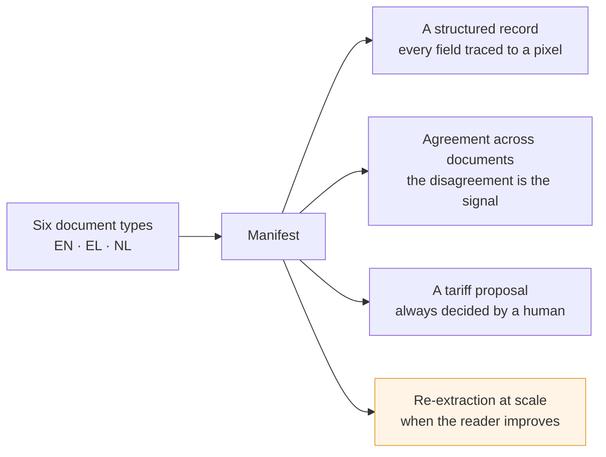
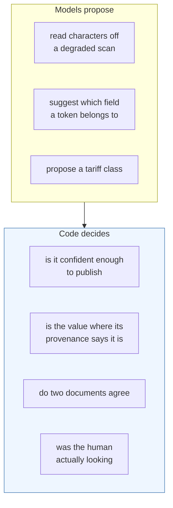
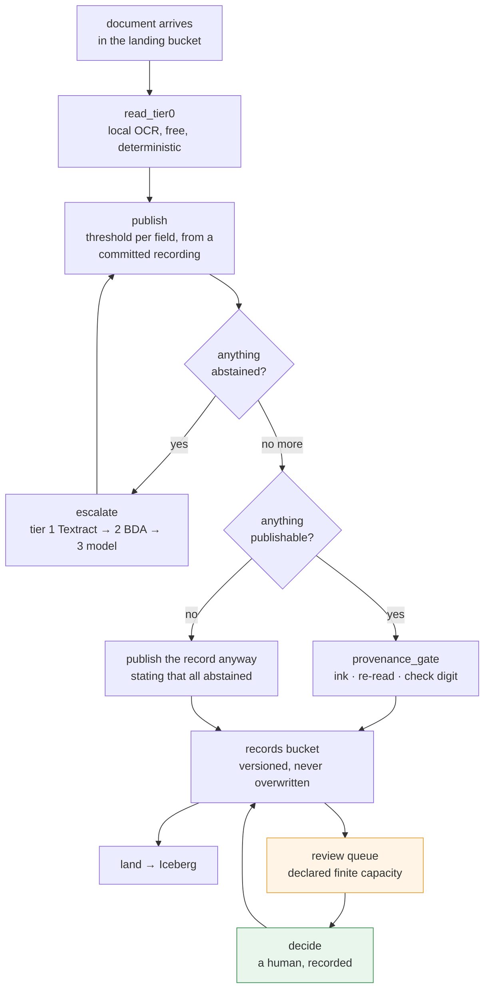
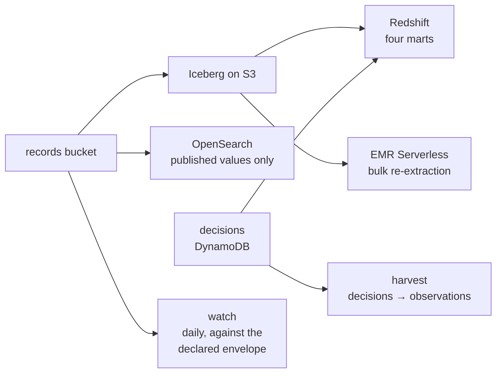
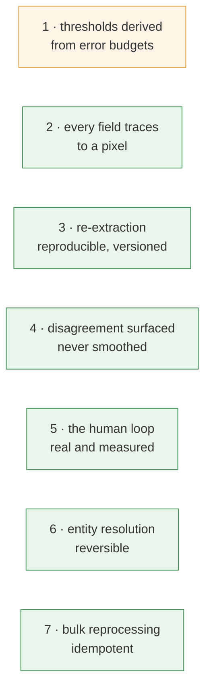
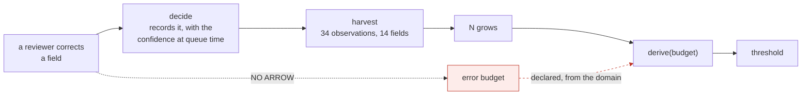
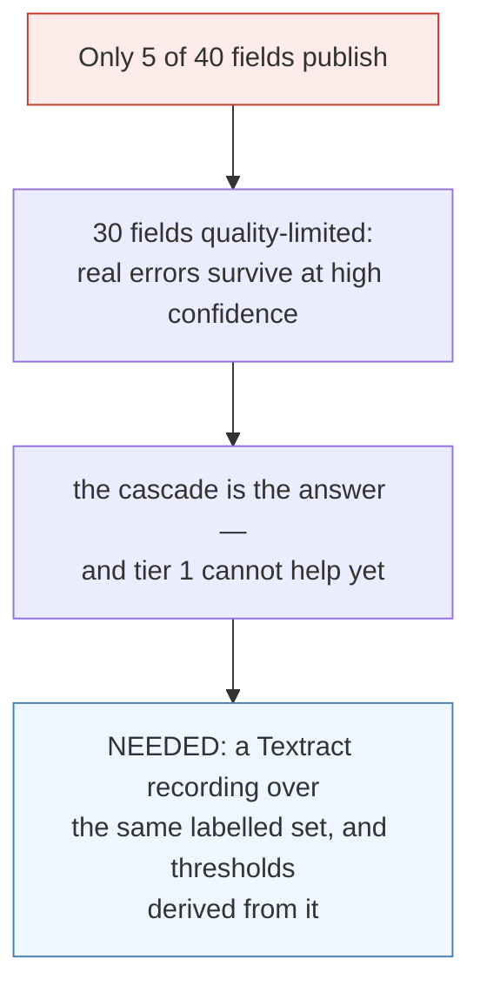
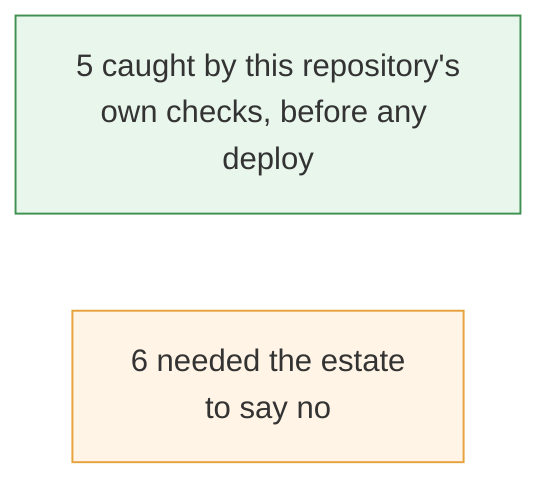
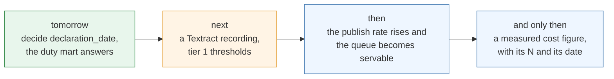

# Manifest — where it stands

*2026-08-14. Written after the estate was brought up, verified end to end and torn down. Every
figure below was produced by a command in this repository, and the second half of the document
is the part that is not finished.*

---

## 1 · What the system is

A customs broker receives six kinds of commercial document as scans of scans — skewed, stamped
over the numbers, in three languages, with tables that break across pages. Three things come
out, and the third is the one nobody demonstrates.

The boundary the whole design rests on: **models read, deterministic code decides.**

---

## 2 · What runs, and where

Thirteen functions in the estate, six Terraform layers, one pure core that imports no cloud SDK
and names no engine. A document's whole path:

Everything downstream reads the records bucket, never the reader:

---

## 3 · The seven claims, and what each one showed

| # | What was shown, on the estate |
|---|---|
| **1** | 5 thresholds derived, 1 always-review by contract, **4 evidence-limited, 30 quality-limited** — every figure with its N. The one claim that is only half green, and §5 says why |
| **2** | Every published box carries ink; a crop re-read agrees; a check digit that contradicts itself refuses. 5 container numbers recomputed, none provably wrong |
| **3** | Same bytes twice land nothing new. A correction writes a **new version beside the old**, both retrievable, the lake recording which replaced which |
| **4** | `SHP00001` **zero** disagreements · `SHP00002` **exactly the one** the generator planted, found by rules that never read the planting |
| **5** | 35 abstentions decided; each approval publishes a superseding version; the decisions reach the warehouse where the agreement rate is computed |
| **6** | Two spellings of one party merged, the merge undone, **every reference re-pointed** |
| **7** | `process 23` → `20 published, 3 refused` → `skip 20, process 3` → `skip 23, nothing to do` |

**Claim 1 is a loop, not a photograph**, and today it closed:

The arrow that does not exist is the whole safety argument: corrections move **N**, never a
budget. `gate-proof` plants that arrow and requires the named gate to refuse it.

---

## 4 · What the offline evidence is

Provable on a laptop, with no AWS account and no credentials:

| Command | Result |
|---|---|
| `make test` | **498 passing**, under a minute |
| `make gate-proof` | **54 refused, 0 accepted, 0 stale** — each gate broken on purpose, the *named* gate must refuse |
| `checkov` | **718 passed, 0 findings** across six layers |
| `make claims` | every contract, the pure core, the corpus envelope, and the seven claim gates |
| `scripts/e2e_verify.py` | **32/32** against a live estate |

---

## 5 · What is **not** done

This is the half that matters. Each item names the fact that makes it unfinished.

**1 · The publish rate is the ceiling on everything else.** The drift watch reports the same
fact from the other side: a 63.8% abstention rate against a declared band of 20%. Not a bug —
the system telling the truth about itself. Closing it means deriving thresholds for a billed
tier, by the apparatus that already exists for tier 0. Cost it first; it would also be the first
place this repository could honestly write *measured* about a billed engine, with an N and a date.

**2 · `gold.declaration_line` is empty, and it is now one field.** This used to be *"the
classifier produces proposals nobody decided"*; `hs_code` is now decided, published and in the
lake. The line is refused because a declaration line needs five fields on one version and
`declaration_date` abstained and nobody decided it. The loader is right to refuse a half line;
the harness simply does not decide that field yet.

**3 · No accuracy figure exists for any billed tier, and none may be invented.** What the
cascade proves is two things and stops: the routing sends low-confidence pages up, and the pages
it *keeps* at tier 0 meet their error budgets. Cost is a **model** — measured routing multiplied
by published prices — and says so wherever it appears.

**4 · Scale is asserted, not demonstrated.** The planner is pure and proved on a laptop, which
is where that proof belongs. The cluster ran **23 documents**, not four million. No load test, no
concurrency, no failure injection.

**5 · The reviewer's identity is in an analytics table and its retention class is unwritten.**
The question is named in the acceptance and not answered.

**6 · The corpus is synthetic**, declared, with its operating envelope in `corpus/envelope.yaml`
and a test that goes red when the generator leaves it. Every figure here is a statement about a
distribution this repository authored, and says so.

---

## 6 · What today cost, and what it bought

Three promises the repository made and did not keep: `core/feedback.py`, `core/drift.py` and
`core/lineitems.py` had **no caller in the running system** — proved offline, never asked. All
three now run, and a new check fails CI when a fourth appears.

Eleven defects were found and fixed. The ratio is the interesting part:

Caught offline: a function calling SNS with no VPC endpoint (it would have hung, not failed); a
Terraform layer that stopped being self-contained; a variable passed invisibly; a shell variable
nobody assigned; a warehouse table the column check could not read — and it said so instead of
passing.

Found by the estate: an enum member written from memory; a property passed to `replace`; an
immutable image tag on a re-deploy of the same commit; **the same tag rule in a second image the
first fix did not touch**; a review marker accumulating in the identity thresholds are keyed by;
and a join on a version that can never carry the decision.

Two of those are one mistake made twice — a name written from memory instead of read — and one
is the repository's own decision 24 in its purest form: a fix applied where the symptom appeared
rather than to every place with that shape, when there were exactly two.

---

## 7 · Where it goes

The estate is torn down. Nothing is running and nothing is billing. Every claim above was scored
offline or against an estate that no longer exists, which is the point: a claim that needs a
running system to check is a claim nobody can reproduce.
